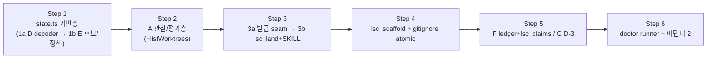

# Plan — deferred-pool (이연 풀 핵심 6종 도구화 + D-3 계약 예외)

## Metadata

| 항목 | 값 |
|---|---|
| Feature | deferred-pool — A) lsc_land+validateWorktreeRemovalTarget B) lsc_scaffold C) /lsc-doctor(R0 흡수) D) CraftState stateVersion E) root-해석 헬퍼 통일 F) 리서치 claim 원장 G) D-3 프루프 계약 예외 |
| 기준 정본 | spec.md(AC 12항·제약 12항 SSOT) · trace.md(seam 좌표 — 전 file:line 잠금) · research/SYNTHESIS.md + claim-graph.md(K1-K10, N1-N7) |
| 환경 | repo HEAD 92e5d12 기반 feat/deferred-pool, worktree `.lsc/worktrees/deferred-pool`, SDK @oh-my-pi/pi-coding-agent 16.4.0 |
| 모드 | **DELIBERATE** (보안 게이트 lsc_land 포함) — pre-mortem·확장 테스트 계획은 appendix |
| 규모 | 6 Step / 9 커밋 — 신규 src 4(land.ts, scaffold.ts, doctor.ts, research/ledger.ts) + 개조 src 7(destructive-approval.ts, ask.ts, state.ts, verdict.ts, worktree.ts, gitignore.ts, main.ts) + paths.ts 헬퍼 1 + 스킬 2(pre-craft, post-craft SKILL.md) + 테스트 ~8 |
| 복잡도 | HIGH (컴포넌트 7종, 보안 게이트 1, 신규 진단 표면 1) |
| 작성일 | 2026-07-19 |
| 개정 | iteration 2 — architect blocking-redesign + critic REVISE 전수 반영(원장: plan/plan-1.md). **iteration 2 리뷰 마감**: architect AWC-equivalent Change Spec 11항 verbatim + critic APPROVE-WITH-CHANGE 보정 2건(C1·C2)·minor 3건 적용(원장: plan/plan-2.md) |

**Appendix Index** (심의 상세는 전부 `plan/` — 코어는 1줄 요약+포인터만):

- `plan/appendix-adr-branches.md` — 결정 D1-D7(발급 seam·operation 결박·audit 증거·E 정책 보존·doctor 표면·F consumer 포함)의 브랜치별 전체 검토(기각 옵션 무효화 근거 + iteration 1 사실 오독 교정 절).
- `plan/appendix-pre-mortem.md` — 실패 시나리오 9종과 방어선(DELIBERATE 요건 충족 — P1 오진 교정 + conflict/partial-land/TOCTOU 신설).
- `plan/appendix-test-plan.md` — Stage 4용 4계층(unit/integration/skill-contract/observability) 확장 테스트 명세 — production seam(등록된 execute 캡처) 중심 iteration 2 재작성.
- `plan/appendix-security-land.md` — lsc_land 위협 모델(T1-T15: 경로 주입·scope 결박·발급 부재·evidence tampering·partial land·TOCTOU·manual escape 기록).

## 1. Context

release-gate가 `[Land]` 태그의 발급 **인프라**(태그 SSOT destructive-approval.ts:22, 인메모리 슬롯, 소비 3단 트랜잭션 템플릿 release.ts:54-88)를 제공하지만, 발급 **경로**는 active craft 전제다(ask.ts:631-655 — `craftAtPrompt = getActiveCraft()` 캡처 + 동일성 조건). post-craft는 active craft 부재가 명시 정상 경로이므로(state.ts:248-251, SKILL.md §1.5) fresh session에서 `[Land]` 승인은 설치되지 않는다 — iteration 1 BLOCKING. 따라서 A는 소비자(lsc_land)만이 아니라 **발급 context seam**(prepared-operation scope)을 함께 배선한다. removeWorktree는 missing 시 성공 no-op하는 fail-open 래퍼(K4, worktree.ts:84-88)다. findPersistedCraftState(open-release 중재, state.ts:345-351)와 resolveAuditRoot(디렉터리-존재, verdict.ts:163-166)는 **서로 다른 권위 정책**이라(K5 재해석 — iteration 1 사실 오독 교정) '단일 해석 통일'이 아니라 decode/후보 seam 공유가 옳다. auditValidated marker는 best-effort trace로 설계돼 있어(verdict.ts:349-360) 단독 권위로 승격할 수 없다 — land는 audit 증거를 land 시점에 독립 재검증한다.

리서치가 각 컴포넌트를 재정의·잠금했다: A-5 순증분은 4종뿐(N1 — dirty/locked/submodule 재구현 금지), doctor exit 계약은 FAIL=1/WARN-only=0(N2), stateVersion 대상은 CraftState뿐(N6), D-3 문구는 "변이 seam 한정 tautology 스모크"로 격하(N5), F 평가기의 실증 원천은 gajae `ledger.ts:110-178`(N4). 테스트 관례는 순수 함수/thin wrapper(vitest는 omp SDK runtime import 불가)와 skill-contract 문자열 계층(산문 항목)이다 — 본 계획의 모든 모듈 배치가 이 제약을 따른다.

단일 feature 성립 조건(trace §5 반박 라운드)은 "조건부 7의 명시 분리"이며 spec Non-Goals가 이를 충족한다. 본 계획은 spec을 재해석하지 않는다.

## 2. Work Objectives

| ID | 목표 1문장 | 소유 파일 |
|---|---|---|
| A | LandOperation(source/target 브랜치+OID·mode) 결박 승인의 발급 seam + fail-closed merge/정리 도구 + audit 증거 land-시점 재검증 + 삭제 전 관찰/평가 검증 | src/craft/land.ts(신규), src/craft/destructive-approval.ts(scope 확장), src/ask.ts(발급 분기), src/craft/state.ts(recordReleaseApprovalAt), src/craft/verdict.ts(read-only 코어 추출), src/artifacts/worktree.ts, src/main.ts, skills/post-craft/SKILL.md |
| B | Stage 0 배선 도구 — 쓰기 capability 2종(worktree 내부 + 정확히 projectRoot/.gitignore) 한정, branch 인자로 prefix 탐지 보존, 재실행 no-op | src/artifacts/scaffold.ts(신규), src/artifacts/gitignore.ts(atomic화), src/main.ts, skills/pre-craft/SKILL.md |
| C | read-only 진단 8검사 — shared runner + 어댑터 2(슬래시 커맨드=UI 뷰·논리 exitCode 표기 / lsc_doctor 도구=FAIL→isError), observe/evaluate 분리, hang 격리 | src/doctor.ts(신규), src/artifacts/gitignore.ts, src/main.ts |
| D | decodeCraftState 단일 decoder — stateVersion 각인·미지 신버전 명시 에러·부재 관용, reader 2종(loadActiveCraft·readPersistedCraftState) 공용 | src/craft/state.ts |
| E | craftStateCandidates 후보/decode seam 공유 + 소비자별 named policy 보존(open-release 중재 / audit-root 디렉터리 존재) | src/craft/state.ts, src/craft/verdict.ts |
| F | claims.json 스키마 + transition-aware 평가기(tombstone 부활 금지) + lsc_claims 도구(decision 필드 단독 소유자) + 정본-projection 계약 산문 | src/research/ledger.ts(신규), src/artifacts/paths.ts(craftClaimsPath), src/main.ts, skills/pre-craft/SKILL.md |
| G | pre-craft §0 명시 예외 + Stage 4 D-3 프로브 절(브라운필드 한정·differential·tautology 스모크 문구) | skills/pre-craft/SKILL.md, test/skill-contract.test.ts |

## 3. Guardrails

**Must Have**

1. lsc_land 완전 fail-closed: 무발급·기소비(replay)·타 사이클·audit cycle/threshold 부재·비-APPROVE·fresh passing run log 부재·marker cycle-aware 위반(current-cycle 다른 verdict·future-cycle)·anchored identity 불일치·operation drift(HEAD/OID 이동)·tracked target-dirty·미등록 worktree 전부 isError (spec 제약 2).
2. 검증 순증분 4종만 + `.git` 판별의 git 중복 주석 (제약 1, N1) — 관찰(inspect)/평가(evaluate) 분리, '순수' 명명은 평가 계층에만.
3. 판정 로직은 순수(SDK-independent) 계층, registrar는 thin (제약 9) — 단 등록·execute 자체는 fake registrar 캡처로 검증(test/destructive-approval.test.ts captureConfirmExecute 선례).
4. doctor는 진단 중 파일 무변경 — read-only 체커 신설 (제약 4), 격리는 per-check try/catch + AbortSignal·주입 타이머 timeout — hang 검사도 전체를 중단시키지 못함 (제약 9).
5. CraftState 읽기 전 경로가 decodeCraftState 단일 decoder 경유 — loadActiveCraft의 별도 JSON.parse 우회 금지. 확장 필드 optional+관용, durable 쓰기는 writeFileAtomicSync (제약 10).
6. E는 정책 보존이 1급: open-release 중재(state.ts:345-351)와 audit-root 디렉터리-존재(verdict.ts:163-166)를 named policy로 각각 유지 — 기존 회귀(test/craft-state.test.ts:481-533) **무수정** green (제약 8).
7. 발급은 기존 lsc_confirm 태그 경로의 확장(prepared-operation scope)만 — persist-before-install 성질 보존, craft-bound 발급 경로 무변경.
8. merge 실패/conflict 시 자동 `git merge --abort` 후 **사후 상태 검증**(branch=targetBranch·HEAD=targetOID·clean status — abort exit code가 판정 기준이 아님: merge 미시작 거부의 false recovery-failed 방지)으로 merge-aborted/merge-recovery-failed 구분 보고(nonce 소비됨·재승인 필요) — conflicted 방치 금지, "repo 원복"은 merge-aborted에만.
9. 산문 항목(B co-evolution, F SKILL 절, G)은 skill-contract 문자열 계층 (제약 6).
10. 각 커밋 시점 `npm test` green + `tsc` 통과 — known-red 구간 없음 (RULE·release-gate 선례).

**Must NOT Have**

1. dirty/locked/submodule 검사 재구현 — git `--force` 의미론(1회=dirty, 2회=locked)에 일임 (제약 1).
2. lsc_land override 플래그 — 탈출구는 수동 bash 복귀, 예외 사유는 `.lsc/crafts/{feature}/audit/land-manual-escape.md`에 durable 기록 (제약 3).
3. 새 승인 메커니즘 발명 — 기존 태그 SSOT·nonce·인메모리 슬롯·소비 템플릿의 **scope 확장만** (제약 2). release.ts 0 변경.
4. persisted `.craft-state.json` 3필드·auditValidated marker의 단독 권위 사용 — ctx.cwd 앵커·live 재검증 대비 **evidence로만**.
5. doctor의 ensure* 호출·모든 쓰기 (제약 4). plugin '실행 중 로드'는 UNKNOWN·exit 미반영 (제약 5).
6. HashManifest·ModelsFile version 필드 (비목표, N6).
7. fixture E2E 실동작 확장·enforcement cap·카운터 확장 (제약 6·11). G 프로브의 이번 feature 내 실행 — 산문+skill-contract만, 안전 경계(hash 보호 밖·커밋 금지·복구 실패 시 중단+비승인 handoff·실행 주체 오케스트레이터) 명기 (제약 12).
8. R0 독립 CLI — doctor 검사 ⑧로만 존재 (비목표). lsc_doctor 도구 어댑터는 CLI가 아니라 registerTool 표면.

## 4. DR 요약 + ADR Summary

**Mode**: DELIBERATE.

### Principles (5)

1. **1 승인 = 1 구체 파괴 작업**: 승인은 LandOperation(source/target 브랜치+OID·mode)에 결박되고, 발급·소비 모두 fresh-session post-craft에서 성립해야 한다 — 발급 없는 소비 설계 금지 (iteration 1 근본 원인 1 교정).
2. **순증분 경계 존중**: git이 절대 못 막는 것만 검증 — 이중화 드리프트 금지 (N1).
3. **관찰/평가 분리**: 판정은 순수 평가 계층(vitest 도달), 관찰은 SDK-independent effect — '순수' 명명은 평가에만 (제약 9).
4. **권위/증거 분리**: 인메모리 슬롯·live 재검증이 권위, persisted marker·3필드는 대조 evidence (제약 2·4).
5. **정책 보존 우선**: D/E는 기존 정상 흐름+보안 중재 회귀 green이 1급 — 서로 다른 권위 정책을 단일 의미론으로 합치지 않는다 (제약 7·8, iteration 1 근본 원인 2 교정).

### Decision Drivers (top 3)

1. AC 전부가 **production seam**(등록된 execute 캡처 포함)에서 기계 검증돼야 한다 — inner reducer green이 사용자 경로 결함을 가리면 안 된다 (iteration 1 근본 원인 3).
2. 보안 표면 fail-closed: 소비는 승인된 구체 작업과의 기계적 일치가 조건, 탈출구는 도구 밖 수동 bash + durable 기록(인간이 궁극 권위).
3. 선례·관례 재사용 극대화(발급 인프라 scope 확장, release.ts 소비 템플릿, captureConfirmExecute, gajae 평가기) — 신규 발명 최소.

### ADR (7결정 — 브랜치별 전체 검토는 appendix-adr-branches)

**Decision**:
- **D1 (배치, 유지)**: land 소비자는 신규 `src/craft/land.ts`, `LAND_CONSUMABLE_TAGS = ["[Land]"]` 소비자 소유(release-gate CS1). `inspectRemovalTarget`/`evaluateRemovalTarget`+`listWorktrees`는 src/artifacts/worktree.ts. release.ts 무변경. destructive-approval.ts는 **opaque scope 확장만** — "발급 인프라는 소비자를 모른다" 불변식 유지.
- **D2 (operation 결박, 재설계)**: 승인 identity는 **ctx.cwd 앵커**(feature, projectRoot=ctx.cwd, worktreeRoot=worktreePath(ctx.cwd,feature)) — persisted 3필드는 앵커 대조 evidence(불일치=isError)로 강등. 승인 scope = `LandOperation{sourceBranch/OID, targetBranch/OID, mode: merge-and-clean|force-clean-only}`(canonical JSON 동등 비교). consume 직전 재관찰 일치 필수 — 승인 후 HEAD/OID 이동은 scope-mismatch 거부(재승인). force 재승인은 mode로 초기 merge 승인과 기계 구분. **effect 결박(iter2)**: merge는 branch ref가 아니라 승인된 `sourceOID`로 실행(`git merge --no-ff --no-edit <sourceOID>` — noninteractive structured-message form), consume 직후 target branch/OID를 effect boundary에서 재확인(drift면 consumed nonce 상태 명시 거부). Phase R은 target `git status --porcelain`에 `??` 이외 엔트리(tracked 변경) 존재 시 target-dirty 거부 — untracked 충돌은 git merge 원생 거부에 위임(untracked-only는 통과, critic C2 — T9/T15 수동 탈출구 정상화 방지).
- **D3 (발급 seam, 신규)**: destructive-approval.ts에 tag-key **prepared-operation 슬롯**(install/peek/invalidate — 인메모리, generic issuance envelope `PreparedDestructiveOperation`) 신설. lsc_land가 preflight 통과·consume miss 시 **현재** envelope를 install/replace하고 "approval-required"+exact approvalQuestion으로 반환(2-phase). ask.ts 발급 분기는 태그-일반 확장: 기존 craft-bound 경로(무변경) **또는** prepared 경로(eligible envelope 존재 — exact question+prepareId 결박, active craft 부재 또는 sameCraftIdentity). land 경로 durable evidence는 신설 `recordReleaseApprovalAt`(exact-root writer, writeFileAtomicSync)로 **persist-before-install 보존**. active craft 재활성화안은 post-craft 계약(SKILL.md §1.5)·enforcement 비확장 제약과 충돌로 기각.
- **D4 (audit 증거, 재설계)**: auditValidated marker 권위 강등. land 전용 **strict 검증 코어 `validateLandAuditEvidence`**(verdict.ts에서 read-only 추출하되 `validateAuditFreshness`의 undefined-tolerant 분기 미사용): persisted state 존재 + integer `auditCycle === latestAuditNumber` + integer `runLogAtCycleStart` + `number > threshold && passed`인 run log 전부 **필수** — cycle/threshold 부재=no-audit-cycle, fresh pass 부재=stale-run-log isError(missing-threshold fail-open 차단). marker는 **cycle-aware evidence**: 부재·이전-cycle=WARN, current-cycle 동일 verdict=일치, current-cycle 다른 verdict·future-cycle=evidence-tamper isError. `recordAuditCycleBegin`은 새 cycle 기록과 함께 이전 `auditValidated`를 원자적으로 clear(stale marker의 다-cycle 가용성 결함 차단). producer 계약 동시 수정: recordAuditValidated docstring·경고문을 "비권위 trace — land는 독립 재검증"으로 갱신(best-effort 유지가 이제 정합).
- **D5 (E, 재설계)**: 공유는 `decodeCraftState`(D 버전 검증 포함) + `craftStateCandidates(cwd, feature)`뿐. findPersistedCraftState의 open-release 중재와 resolveAuditRoot의 디렉터리-존재 정책은 서로 다른 권위라 **named policy로 각각 보존** — '단일 선택 의미론' 포기(iteration 1 양쪽 사실 전제 오독 교정, appendix 동시 수정).
- **D6 (doctor 표면, 재설계)**: shared runner(`runDoctor(ports) → DoctorReport{findings, exitCode}` — 논리 exit) + 어댑터 2: 슬래시 커맨드(UI 뷰·exitCode 표기, SDK handler `Promise<void>` 계약 준수)와 `lsc_doctor` 도구(FAIL≥1→isError — 게이트/자동화 소비). real process exit 요구는 spec AC7에서 논리 exit+도구 isError로 교정(독립 CLI 비목표 유지). ports는 observe(effect)/evaluate(pure) 분리 + AbortSignal·주입 타이머 timeout seam.
- **D7 (F consumer, 결정)**: transition-aware `evaluateLedger(claims, previousDecisions)`(tombstone 단조 — 부활 금지가 검증 가능) + **lsc_claims 도구 등록** 채택. library-only는 runtime consumer 0의 dead library(최소 유효 표면 위반의 반대 방향)라 기각. decision 필드는 도구 단독 소유 — 정본-projection 계약이 실제로 강제됨.

**Drivers**: 위 top 3. **Alternatives considered**: 각 결정 옵션 ≥2 + 무효화 근거 — appendix-adr-branches(발급 3안·결박 3안·E 3안·doctor 3안·F 2안 포함) 전면 갱신.

**Consequences**: ask.ts·destructive-approval.ts 개봉으로 release-gate 발급 경로에 회귀 표면 발생 — craft-bound 경로 0 변경 + 기존 스위트가 고정. land는 부분 실패 상태 기계(merge-aborted / merge-recovery-failed / merged-but-not-cleaned / cleaned-but-not-pruned / cleaned)를 사유 코드로 보고. doctor는 R0 리터럴 의존으로 마지막 착지 유지. 순서는 **D→E→A**(decoder가 후보 수집의 전제, 후보 seam이 land 로드의 전제).

**Follow-ups**: 잔여 산문-중복 5+ 지점(trace H3)·D-1·E-2/B-2/C-2p2는 후속 feature. prepared-operation 슬롯의 타 태그 활용([Canon Amendment] scope 결박)은 후속 후보. doctor 검사 추가는 WARN 계열 확장 후보로만 기록.

## 5. Task Flow

순서 강제 근거: **D→E** (craftStateCandidates가 decoder 경유 — decoder 선행), **E→A** (land의 persisted 로드가 후보/decoder seam 경유), **발급(3a)→소비(3b)** (소비자 테스트가 실 등록 발급 경로를 사용), **A 관찰/평가층→A 도구** (순수 계층 우선), **Step 3-5→C** (doctor R0가 SKILL 경로 리터럴 대조 — 산문 확정 후 착지). Step 4·5는 상호 독립이나 같은 pre-craft SKILL.md를 편집하므로 직렬(충돌 회피).

| 커밋 | 내용 | `npm test`+`tsc` |
|---|---|---|
| 1a | D decodeCraftState + reader 2종 공용 + 쓰기 각인 | green |
| 1b | E craftStateCandidates + named policy 2종 보존(기존 회귀 무수정) | green |
| 2 | A inspect/evaluate + listWorktrees + membership 헬퍼 | green |
| 3a | 발급 seam: operationScope·prepared-operation 슬롯·ask.ts 분기·recordReleaseApprovalAt | green |
| 3b | lsc_land + verdict.ts read-only 코어 추출 + post-craft SKILL co-evolution | green |
| 4 | B lsc_scaffold + gitignore atomic화 + pre-craft SKILL Stage 0 co-evolution | green |
| 5a | F ledger + lsc_claims + 리서치 절 산문 | green |
| 5b | G §0 예외 + Stage 4 프로브 절 | green |
| 6 | C doctor 코어 + read-only 체커 + 커맨드/도구 어댑터 | green |

## 6. Detailed TODOs (PR 단위)

### Step 1 — state.ts 기반층 (커밋 1a: D / 1b: E)

**1a (D) — decodeCraftState 단일 decoder**
- `CRAFT_STATE_VERSION = 1` 상수 + CraftState `stateVersion?: number` optional(state.ts:38-48 docstring 관례). 신설 `decodeCraftState(path)`: 부재→undefined, JSON.parse, 버전 검사(부재→관용, `> CRAFT_STATE_VERSION`→파일 경로·발견 버전·지원 상한 포함 명시 에러 — Cargo 준거 N6).
- **reader 2종 전부 decoder 경유**: readPersistedCraftState(state.ts:333-337) + loadActiveCraft(state.ts:189-192 — 별도 JSON.parse 우회 제거). 쓰기 경로(writeFileAtomicSync 경유 전부)에 각인.
- **AC9**: reader 2종 **각각** {각인, 미지 신버전 명시 에러, 부재 관용} — 신버전의 침묵 active 승격 차단이 핵심 케이스. HashManifest/ModelsFile 비접촉.

**1b (E) — 후보/decode seam 공유 + named policy 보존**
- 신설 `craftStateCandidates(cwd, feature)`: 후보 2종(cwd, worktreePath(cwd,feature))의 **descriptor `{root, statePath, rootExists, stateFileExists}`만 반환 — JSON을 읽지 않는다**(lazy). decode는 state가 필요한 소비자만 `decodeCraftState(candidate.statePath)`를 호출(eager decode 금지 — malformed state가 state를 읽지 않던 소비자 정책에 유입되지 않게).
- findPersistedCraftState(state.ts:345-351)는 **open-release 중재 정책 그대로**(open candidate wins → worktree tie-break) — 후보 descriptor 수집만 seam 경유, decode는 자신이 호출. resolveAuditRoot(verdict.ts:163-166)는 **디렉터리-존재 정책 그대로** — worktree descriptor의 `rootExists`만 보고 state file을 decode하지 않는다. 두 정책이 서로 다른 권위(보안 중재 vs artifact-root)임을 각 함수 주석에 명시 — 단일 의미론 통합 금지.
- **AC10**: 기존 회귀(test/craft-state.test.ts:481-533 포함) **무수정** green + both-root open-release(cwd open이 stale closed worktree를 이김)·neither 케이스 + **malformed `.craft-state.json`이 있어도 worktree 디렉터리가 존재하면 resolveAuditRoot는 worktree 반환**(decode 비의존 회귀) — 파싱 불가는 findPersistedCraftState(decode 소유자)에서만 정책 고정.

### Step 2 — A 관찰/평가층 (src/artifacts/worktree.ts)

- `inspectRemovalTarget(candidate, ports)`: lstat(심링크)·realpath·존재 관찰 수집 — **SDK-independent effect**('순수' 명명 금지). `evaluateRemovalTarget(observation, expectedRoots)`: **순수 평가** — 거부 = 빈/공백·NUL·`.`/`..`/`~`·경로 구분자 주입·심링크·realpath containment 밖(expectedRoots 원천 paths.ts:94)·root/home·메인 리포(`.git` 디렉터리 — git R1/R2 중복 주석). 검사 순서 OMC 원천 보존(sanity→심링크→realpath→containment).
- `listWorktrees()` porcelain 파서(prunable reason 포함, N1) + `isRegisteredWorktree(path)` membership 헬퍼 — land preflight·삭제 직전 재검사·doctor ⑤ 공용.
- removeWorktree(worktree.ts:84-88)는 무변경 — **missing 시 성공 no-op 함정을 주석 명시**, land는 membership 확인으로 미등록을 별도 isError 처리(성공 혼동 차단). validated 삭제 경로는 land.ts **단일 호출점** — 기존 "executor 재량" 조항 삭제.
- **AC4**: evaluate 거부 매트릭스 전수(관찰 fixture 주입) + dirty/locked 비검사 음성 확인 — 순수 vitest.

### Step 3 — A 발급 seam + lsc_land (커밋 3a: 발급 / 3b: 소비)

**3a — 발급 seam (destructive-approval.ts + ask.ts + state.ts)**
- destructive-approval.ts: tag-key **prepared-operation 슬롯**에 **generic issuance envelope** `PreparedDestructiveOperation{prepareId, tag, identity: ApprovalCraftIdentity, operationScope: JsonValue, approvalQuestion, evidenceRoot}` 설치(install/peek/invalidate — 인메모리). `operationScope`만 consumer-opaque, envelope 자체는 generic issuance metadata — "발급 인프라는 소비자를 모른다" 유지. **prepared slot은 trusted/non-authoritative issuance context, pending slot만 sole volatile consume authority**(prepared는 human yes 없이 설치되므로 권위 불가). `PendingDestructiveApproval.operationScope?`와 durable `ReleaseApprovalEvidence.operationScope?`는 optional 추가 — release.ts 0 변경 유지. consumePendingApproval의 `expectedScope` 비교는 **둘 다 undefined=match / 한쪽만 undefined=scope-mismatch / 둘 다 존재=canonical JSON equality**로 고정(unscoped caller의 scoped approval 우회 소비 차단; 불일치는 슬롯 보존 거부 — CS11 조건부 non-burn 관례).
- ask.ts 분기 계약(prepared branch 우선, craft-bound 무변경): prompt 시작 시 `craftAtPrompt`와 `preparedAtPrompt = peekPreparedOperation(tag)`를 캡처하고 기존 `invalidatePendingApproval()` 그대로 수행. platform yes 뒤 **prepared branch를 먼저 평가**: tag 일치 + `params.question === prepared.approvalQuestion`(exact question 결박 — cross-feature confused-deputy 차단) + 같은 `prepareId`가 confirm 전후 유지 + (active craft 부재 **또는** `sameCraftIdentity(prepared.identity, getActiveCraft())`)일 때만 scoped pending 발급 — same-session post-craft는 matching prepared가 있을 때만 prepared branch 우선(명시 계약). 발급 순서: `recordReleaseApprovalAt(prepared.evidenceRoot, prepared.identity, evidence-with-scope)` 성공 → `installPendingApproval` → matching prepared entry를 conditionally invalidate(prepareId 기준). no/free/cancel·wrong question·identity/context drift·persist throw에서도 captured prepared entry를 conditionally invalidate. eligible prepared entry 부재 시 기존 craft-bound 분기의 조건·`recordReleaseApproval`·반환값 **그대로**.
- state.ts 신설 `recordReleaseApprovalAt(root, identity, evidence)` — **exact-root writer 계약**: `craftStatePath(root, identity.feature)`를 exact path로 read/write하고, persisted `feature/projectRoot/worktreeRoot` 3필드가 identity와 전부 일치하는지 검사한 뒤 `writeFileAtomicSync`. generic `persist(next)` 호출 금지·persisted path 필드를 write authority로 사용 금지(read-back state의 경로 필드가 권위가 되면 권위/증거 분리 붕괴). 불일치/부재/write failure는 throw — pending 미설치(persist-before-install 보존, P7). matching active craft가 있으면 successful persist 뒤에만 in-memory state 갱신.
- **AC2 전반부**: captureConfirmExecute 관례로 **실 등록 lsc_confirm execute** 캡처 — fresh-session(active craft 없음) [Land] 발급 성립 + craft-bound 발급 경로 회귀 green.

**3b — lsc_land (신규 src/craft/land.ts + verdict.ts 코어 추출 + src/main.ts + skills/post-craft/SKILL.md)**
- 입력: `{feature, mode?: "merge-and-clean"(기본) | "force-clean-only"}`. `LAND_CONSUMABLE_TAGS = ["[Land]"]` 소비자 소유(D1). 순수 게이트 리듀서 + effectful adapter 분리(제약 9).
- **Phase R (read-only preflight — nonce 무소비)**: ① 앵커 identity 구성(feature, projectRoot=ctx.cwd, worktreeRoot=worktreePath(ctx.cwd,feature)) ② 후보/decoder seam으로 persisted 로드 — 3필드 앵커 불일치→isError(evidence-mismatch) ③ **strict audit 재검증**: `validateLandAuditEvidence`(D4 — persisted state 존재+integer auditCycle===latestAuditNumber+integer runLogAtCycleStart+`number>threshold&&passed` run log 필수, legacy-tolerant 분기 미사용)로 최신 audit-N.md verdict∈APPROVE_FAMILY 확인 — cycle/threshold 부재=no-audit-cycle, fresh pass 부재=stale-run-log; marker는 cycle-aware(부재·이전-cycle=WARN 보고, current-cycle 동일 verdict=일치, current-cycle 다른 verdict·future-cycle=evidence-tamper isError) ④ git 관찰: target=projectRoot HEAD 브랜치+OID(feature 브랜치면 self-merge isError — checkout은 스킬 산문 선행 지시, 도구 무 checkout 유지), source=worktree 브랜치+OID, `isRegisteredWorktree` 확인(미등록=not-registered isError), **target `git status --porcelain`에 `??` 이외 엔트리(tracked 변경) 존재 시 target-dirty isError**(untracked-only는 통과 — 충돌은 git merge 원생 거부 위임) ⑤ inspect/evaluate 삭제 대상 검증. **Phase R 실패는 같은 tag의 prepared entry를 clear.**
- **Phase C/P (consume-first — R 성공 후)**: 현재 관찰로 operation envelope를 재구성해 **consume을 먼저 시도**(태그·앵커 identity·expectedScope). success면 prepared entry clear 후 Phase X. `no-pending`·tag/identity/scope mismatch면 pending의 conditional non-burn은 유지하되 **현재** operation envelope를 prepared 슬롯에 install/replace하고 exact `approvalQuestion`+원인 코드를 담은 isError **"approval-required"** 반환(작업 요약 포함 — 스킬이 `[Land]` 질문에 exact question 인용). 다음 `[Land]` prompt entry가 오래된 pending을 revoke(기존 invalidatePendingApproval)하고 새 scope를 발급 — scope mismatch→재승인 왕복(O2 성공)이 이 전이로 성립. public `no-pending-approval` 사유 코드는 **제거** — replay는 "effect 없음+approval-required" 또는 이미 clean된 성공 replay의 not-registered로 검증.
- **Phase X (effects — 소비 후)**: consume 직후 target branch/OID를 effect boundary에서 재비교 — drift면 consumed nonce 상태를 명시해 거부. merge-and-clean = **`git merge --no-ff --no-edit <approved sourceOID>`**(branch ref 금지 — consume 후 source ref 이동에도 승인된 OID만 merge) → 실패/conflict 시 자동 `git merge --abort` 후 **사후 상태 검증(branch=targetBranch·HEAD=targetOID·clean status — abort exit code 아님)**: 검증 성공=isError merge-aborted(nonce 소비됨·재승인 필요 — "repo 원복"은 이 경우에만 보고), 검증 실패=isError merge-recovery-failed(원복 미보장 명시) → **삭제 직전 재검사**(membership + inspect/evaluate 재실행 — TOCTOU 완화, 잔여 위험은 appendix-security-land 선언) → removeWorktree(무 force) → prune. post-merge validation/remove 실패→isError **merged-but-not-cleaned**(merge 완료·worktree 보존·mode=force-clean-only 재승인 안내), remove 성공 후 prune 실패→isError **cleaned-but-not-pruned**(merge/worktree/prune 실제 state flags 보고). force-clean-only = merge 생략 → 재검사 → removeWorktree({force:true} — `--force` 정확히 1회, locked 불가침) → prune.
- 사유 코드 집합(public): no-audit-evidence / no-audit-cycle / cycle-mismatch / verdict-not-approve / stale-run-log / evidence-tamper / evidence-mismatch / approval-required / scope-mismatch / identity-mismatch / self-merge / not-registered / target-dirty / merge-aborted / merge-recovery-failed / merged-but-not-cleaned / cleaned-but-not-pruned / validation-reject. (`no-pending-approval` 제거 — 2-phase 규칙상 도달 불가 코드.)
- producer 계약 동시 수정: recordAuditValidated(verdict.ts:349-360) docstring·경고문을 "비권위 trace — land는 독립 재검증" 문구로 갱신.
- post-craft SKILL co-evolution: :228-240 4단 bash → **2-phase lsc_land 흐름**(호출→approval-required 요약을 [Land] 질문에 인용→재호출), checkout 선행 지시 유지, :208-210 scope note·§7.1 프로즈를 도구 게이트 참조로 갱신, 탈출구 절 신설 — 예외 사유의 durable 기록 위치 `.lsc/crafts/{feature}/audit/land-manual-escape.md` 지정(도구 결함 시에만·exact base 재확인·fresh 승인 유지).
- **AC1·AC2·AC3**: 사유 코드 전 변형 + production 전 경로(발급→소비, 재승인 왕복 포함) + 실패 경로(conflict abort 사후검증·abort 실패→merge-recovery-failed·target-dirty(tracked)/untracked-only 양성·source ref drift에도 approved sourceOID merge·prune 실패→cleaned-but-not-pruned·dirty→force·locked/main/미등록) — appendix-test-plan W2-a.

### Step 4 — lsc_scaffold (신규 src/artifacts/scaffold.ts + gitignore.ts + src/main.ts + skills/pre-craft/SKILL.md)

- 쓰기 capability **정확히 2종 선언**: `worktreePath(cwd,feature)/**` + 정확히 `projectRoot/.gitignore` — 그 외 전부 거부(심링크 realpath 이중 containment — S2 이식 코어).
- gitignore atomic writer 소유자 = **gitignore.ts**: `ensureGitignored`(gitignore.ts:23-32)의 writeFileSync를 writeFileAtomicSync로 교체 — 전 호출자 원자성 획득, 내용 동등(행동 보존). scaffold는 기존 helper 재사용(신규 gitignore 로직 금지).
- branch 보존: 입력 `{feature, branch?}` → addWorktree options.branch(worktree.ts:61-63 기존 인자) 전달. Stage 0 branch-prefix 탐지(SKILL.md:80-87)는 스킬 산문에 잔존 — 탐지 결과를 branch 인자로 전달하도록 co-evolution 지시.
- 재실행 no-op은 실재 검사 기반(lazycodex loose sentinel 교정 — S2), 검증은 **내용 대조**(mtime 단언 금지 — fs 해상도 취약).
- **AC5**: no-op·심링크 거부·capability 2종 밖 거부·TS 함수 경유 행동 동등 + branch 인자. **AC6(B)**: skill-contract.

### Step 5 — F+G (커밋 5a: ledger+도구 / 5b: D-3 절)

**5a (F) — transition-aware 원장 + lsc_claims**
- src/research/ledger.ts(순수 — fs 무접촉): claims.json 스키마(claim별 `dropCondition` 필수 + **per-claim 현재 `decision:{status,reasons,evaluatedAt}`** — "이력" 아님, history는 git에 위임) + `evaluateLedger(claims, previousDecisions)` — `previousDecisions`는 기존 per-claim 현재 status에서 구성. 판정 사다리(D4 이식: dropCondition 누락→invalid; 반박 있고 살아남은 지지 없으면 무조건 rejected — gajae :145-148 주석 취지 보존; no-evidence→uncertain; 지지 생존→accepted) + **tombstone 단조 전이: previous가 rejected/invalid면 어떤 신규 지지로도 불부활**(CALM, N4) — transition 입력이 있어야 부활 금지가 검증 가능.
- `lsc_claims` 도구(main.ts 등록): 입력 `{feature_dir}` — **kebab-case slug만 허용**(`.`/`..`/NUL/경로 구분자 주입은 write 전 거부). root는 **`worktreePath(ctx.cwd, feature)`로 고정**(all-in-worktree 정책 — main cwd=projectRoot에서 잘못된 project-root artifact 읽기/쓰기 차단) + registered worktree 확인 + claims parent realpath containment + target/parent symlink 거부. **전 claims를 먼저 parse+validate+evaluate — 한 개라도 invalid면 byte 0 변경**, 전부 성공한 뒤 `craftClaimsPath(worktreeRoot, feature)`에 **단 한 번 `writeFileAtomicSync`**(별도 decisions.json·TTL 도입 금지). decision write-back은 per-claim 현재 `decision` 교체 + projection 요약 반환. **decision 필드는 도구 단독 소유**(사람/LLM은 claims/evidence만 기록 — schema+skill 규약으로 강제). 스키마 위반 isError.
- pre-craft SKILL 리서치 절: claims.json=정본, SYNTHESIS.md=projection(역방향 편집 금지) + **각 wave 종료 시 lsc_claims 호출** 지시 + "비적대·부주의 결정론적 하한" 프레이밍(오라벨 한계 병기 — N4).
- **AC11**: 사다리 매트릭스 + tombstone 부활 금지(transition) + registrar 캡처 + **wrong-root/traversal/symlink/invalid-one-no-write 거부** + skill-contract 문구.

**5b (G) — D-3 프루프 계약 예외** (iteration 1 초안 유지)
- pre-craft SKILL §0 명시 예외("일회성 임시 변이 + 즉시 원자 복구" — 구현 작성 허용 아님) + Stage 4 프로브 절: 브라운필드 한정·단일 변이·baseline-green 독립 서브셋 failure delta(full run RED 판정 금지)·oracle-mirroring 회피(S14)·revert 후 `git diff` 청결·`D-3: N/A` 규칙·"변이 seam 한정 tautology 스모크"(N5).
- 안전 경계 명기(제약 12): hash 보호 밖 구현 소스만·변이 커밋 금지·복구 실패 시 중단+비승인 handoff·실행 주체 Stage 4 오케스트레이터.
- **AC6(G)**: skill-contract.

### Step 6 — doctor (신규 src/doctor.ts + gitignore.ts read-only 체커 + src/main.ts)

- `collectObservations(observePorts)`: readFile/exists/readdir/exec(cmd,{signal}) — **effect adapter**(SDK-independent). per-check deadline = AbortController + 주입 setTimeout/now: 초과 시 해당 검사 UNKNOWN(timeout), 전체는 완주. `evaluateFindings(observations)`: **순수** — `Finding{id, status: PASS|WARN|FAIL|UNKNOWN, evidence, remediation}`. `runDoctor(ports) → DoctorReport{findings, exitCode}` — **논리 exit**(FAIL≥1→1, else 0 — WARN/UNKNOWN-only=0, N2).
- 어댑터 2(둘 다 thin, main.ts 등록): `registerDoctorCommand`(슬래시 커맨드 — 검사별 표+증거 인용+remediation+논리 exitCode 표기, SDK handler `Promise<void>` 준수, S17 슬래시 없는 이름) + `registerDoctorTool`(`lsc_doctor` — FAIL≥1→isError, 게이트/자동화 소비용). 독립 CLI 없음.
- 검사 8종(iteration 1 유지): ① dist↔src 드리프트(src-hash.ts:55-88, srcHash canonical — BUILD_INFO stale은 보조 S9) ② plugin link(실행 중 로드 UNKNOWN — 제약 5) ③ agents frontmatter(물리 9종 SSOT, README 불일치 WARN) ④ models.yaml(validate.ts:39-51+inject.ts:34-50 패턴) ⑤ 고아 worktree(listWorktrees prunable 세분) ⑥ stale craft-state 3조건 ⑦ gitignore 등록 — **read-only 체커 신설**(ensure* 호출 금지, 제약 4) ⑧ R0: skills/*.md 경로 리터럴 vs paths.ts 파생 기대 집합(하드코딩 금지).
- **AC7**: 표·논리 exitCode·도구 isError 매핑·진단 전후 무변경(해시 대조)·hang 포함 격리. **AC8**: 8검사 조작 fixture 판정 + hung check UNKNOWN(timeout).

## 7. AC Coverage Matrix (spec AC 12항 전수)

| AC | 요약 (교정된 spec 기준) | Step | 검증 계층 | 예정 테스트 파일 |
|---|---|---|---|---|
| 1 | 무검증 land 거부 — no-audit-evidence·no-audit-cycle·cycle-mismatch·verdict-not-approve·stale-run-log·evidence-tamper(cycle-aware)·evidence-mismatch·scope/identity-mismatch·target-dirty 전 변형 isError | 3b | unit(리듀서)+integration | test/craft-land.test.ts(신규) |
| 2 | **production 전 경로**: 실 등록 lsc_confirm 발급(캡처된 execute·fresh-session)→lsc_land 소비(approved sourceOID merge+remove+prune) + replay(기소비 재사용 — effect 없음+approval-required 또는 not-registered) 거부 + wrong-target(승인 후 HEAD 이동→scope-mismatch→현재 envelope replace→fresh question 재승인 왕복 O2 성공) | 3a+3b | integration(captureConfirmExecute+fixture git repo) | test/craft-land.test.ts |
| 3 | 실패 경로: merge conflict→자동 abort+사후 상태 검증(merge-aborted/merge-recovery-failed 구분) / target-dirty(tracked) 거부·untracked-only 통과 / dirty→merged-but-not-cleaned→force-clean-only 재승인 성공(mode scope 결박) / prune 실패→cleaned-but-not-pruned / locked·main·미등록 불가 | 3b | integration | test/craft-land.test.ts |
| 4 | evaluateRemovalTarget 거부 매트릭스(관찰 fixture) + dirty/locked 비검사 음성 확인 | 2 | unit 순수 | test/artifacts-worktree.test.ts(확장) |
| 5 | scaffold 결정성(내용 대조 no-op·심링크·capability 2종 경계·TS 함수 경유·branch 인자) | 4 | integration(tmp fixture) | test/artifacts-scaffold.test.ts(신규) |
| 6 | 스킬 co-evolution(B: scaffold+branch 지시 / G: D-3 절) | 4+5b | skill-contract 문자열 | test/skill-contract.test.ts(확장) |
| 7 | doctor 표·논리 exitCode·lsc_doctor isError 매핑·read-only·hang 포함 격리 | 6 | unit+integration(ports 주입+fake registrar 캡처) | test/doctor.test.ts(신규) |
| 8 | doctor 8검사 정확성(조작 fixture) + hung check UNKNOWN(timeout) | 6 | unit(fixture ports) | test/doctor.test.ts |
| 9 | stateVersion — **reader 2종 각각** 각인·미지 신버전 에러·부재 관용 | 1a | unit | test/craft-state.test.ts(확장) |
| 10 | E — named policy 2종 회귀 무손상(:481-533 무수정) + both-root open-release + descriptor-only 후보 seam(malformed state 비유입 — resolveAuditRoot decode 비의존) | 1b | unit 회귀+엣지 | test/craft-state.test.ts·craft-verdict.test.ts |
| 11 | 평가기 사다리 + tombstone 부활 금지(transition 입력) + lsc_claims registrar 캡처 + 정본-projection 문구 | 5a | unit+registrar 캡처+skill-contract | test/research-ledger.test.ts(신규) |
| 12 | 기존 단위 스위트 전수 green(회귀 — craft-bound 발급 경로 포함) | 전 단계 | `npm test` 전수 | 전체(커밋별 게이트) |

누락 0 — 교정된 spec AC 12항과 1:1 매핑.

## 8. Success Criteria

1. run_test.sh가 AC 12항을 기계 검증 — production seam(등록된 execute 캡처) 포함 12/12 green.
2. 9커밋 각각 `npm test` green + `tsc` 통과(known-red 구간 없음).
3. doctor 1회 실행 전후 리포 파일 무변경(해시 대조).
4. 신규 표면 등록: 도구 4(lsc_land, lsc_scaffold, lsc_claims, lsc_doctor) + 커맨드 1(lsc-doctor) — fake registrar 캡처로 등록·execute 기계 검증.
5. release.ts 0 변경. destructive-approval.ts·ask.ts는 scope 확장만 — craft-bound 발급·소비 경로 기존 스위트 green. enforcement·해시 보호·질문 태깅 규약 불변(제약 11).

## 9. Open Questions

iteration 1의 잠정 채택 3건은 리뷰 판정으로 **전부 종결** — open-questions.md에 처분 기록:

1. lsc_land 브랜치 규칙: 잠정안(HEAD가 feature 브랜치만 아니면 진행) **거부됨** → D2 operation 결박 채택(무 checkout 유지 + 승인된 target 브랜치/OID와 정확 일치 필수).
2. E both-exist 우선순위: 잠정안(worktree 우선 단일 정책) **거부됨** → D5 정책 분리 채택(open-release 중재·디렉터리-존재 각각 보존).
3. removeWorktree 이중 배선: 호출점 배선 채택 + **"executor 재량" 조항 삭제** — validated 삭제는 land.ts 단일 경로.

현재 구현 차단 미해결 질문 없음.

## 10. Review Status

- Architect: AWC-equivalent (iteration 2) — Change Spec 11항 verbatim 적용 완료(redesign 불필요 판정)
- Critic: APPROVE-WITH-CHANGE (iteration 2) — MAJOR 2건 보정(C1 신뢰 경계 타깃·C2 target-dirty tracked 한정) + minor 3건 적용, diff-only recheck 대기
- 이터레이션 원장: `plan/plan-1.md` (iteration 1) · `plan/plan-2.md` (iteration 2 — 두 리뷰 판정·적용 diff 요약)
