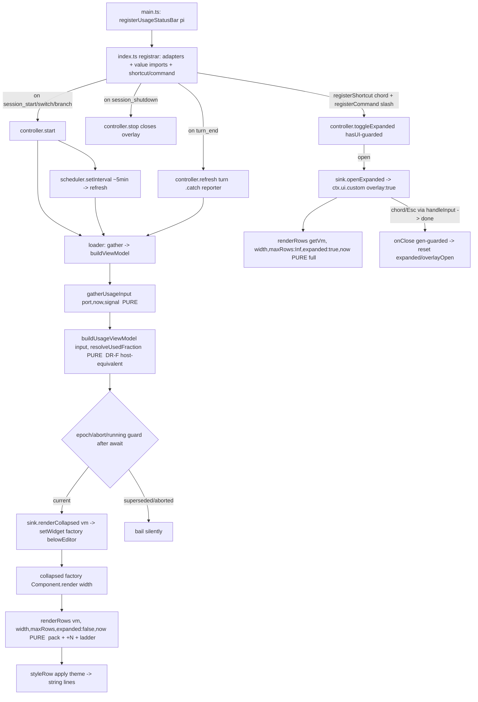

# Plan — provider-usage-status-bar

> Pre-craft Stage 3 (Plan) — **consensus iteration 5**. Input of record: `spec.md` (11 acceptance criteria AC1–AC11, assumptions A1–A12 — **A12 supersedes A11**: the bar is a **row-bounded collapsed summary by default** and is **user-toggleable to a full expanded view**; **AC10 just clarified** — both transports EXPAND, the focused overlay closes via the same chord/`Esc`, and the ENTIRE subsystem is `hasUI`-gated) and `trace.md` (H1 verified, omp APIs cited by file:line). This plan is **implementation-ready for `lsc-executor`** — it does not re-derive host APIs (verified in `trace.md` + §3); it adds the concrete `src/` integration facts, the design decisions, and the AC1–AC11 contracts needed to build the module.
>
> **Iteration-3 outcome (addressed here):** architect (`PlanArchitect3`) = **BLOCKING**, critic (`PlanCritic5`) = **REVISE** — both endorse the core architecture (A12 bounded collapsed + on-demand overlay; host-equivalent attribution primitives; generation-guarded latest-wins refresh with `turn_end` `.catch`; DELIBERATE depth) and converge on the **same 6 remaining fixes**, all closed here:
> - **#1 AC10 chord-close** — the focused overlay's own `handleInput` now closes on the **same chord OR `Esc`** (`matchesKey` value import in `index.ts`; the factory's `keybindings` param is a fresh empty manager, so the chord is matched on raw `data` — N1); both transports **expand**, the slash command is open-only while modal (matches the just-clarified spec AC10). (DR-G, Step 1, Step 5, §7-AC10)
> - **#2 DR-F `identityUnsafe`** — a report-level flag (metadata/scope conflict, or ≥2 distinct identity-scope values) **excludes conflict/multi-scope reports from ALL tiers incl. the singleton fallback** → they render `unavailable`, never wrong-account; +2 fixtures. (DR-F, Step 3)
> - **#3 overlay re-description** — G-f is a **focused normal-buffer overlay** (`ctx.ui.custom({overlay:true})` does **not** forward `fullscreen`), not alt-screen; the no-prompt-clip conclusion survives (it composites over the visible window without growing the root frame); Gate 1 verifies normal-buffer restoration. (V4, Principle 5, DR-G, ADR, Gate 1)
> - **#4 force-close + `overlayGeneration`** — `ctx.ui.custom` returns only `Promise<T>` (no `OverlayHandle`), so the adapter **captures the factory's `done`** for idempotent force-close and the controller **generation-guards `onClose`** so a `close→reopen→stale-old-close` can't flip the new overlay's state; +ordering test. (Step 1, Step 5, pre-mortem #7)
> - **#5 tiny-height ladder** — `deriveMaxRows(H≤1)=0` (strict `W<H`) + a normative `maxRows=0/1/2` render (0→nothing; 1→`<top-risk> · +N more`, no header; 2→header+synthesized row); +`H={1,2,5,10}` fixtures. (Step 4, pre-mortem #4)
> - **#6 whole-subsystem `hasUI` gate** — `session_start/switch/branch` (and `turn_end`) bail when `!ctx.hasUI`, so **no polling/fetch/widget/interaction starts headless** (spec AC10 "the ENTIRE subsystem is `ctx.hasUI`-gated"). (Step 5)
>
> **Iteration-4 outcome (addressed here — this is the FINAL revision):** architect (`PlanArchitect4`) = **BLOCKING** and critic (`PlanCritic6`) = **REVISE** both **independently confirmed #1, #2, #3, #5, #6 CLOSED** and converged on **#4 (expanded-overlay lifecycle) as the sole remaining blocker** — apply-only, no architecture change. Closed here:
> - **#4 single-owner force-close** — a lone controller primitive **`forceCloseExpanded()`** (`if (!expanded && !overlayOpen) return; expanded=false; overlayOpen=false; ++overlayGeneration; sink.closeExpanded();`) now owns **every** programmatic close: `toggleExpanded()`'s else-branch **and** `refresh()`'s empty path route through it, and `sink.clear()` is reduced to `setWidget(undefined)` only — so the empty path can no longer bypass the generation owner. The adapter captures a **per-open `ownDone`** so a stale overlay's late settlement clears only its *own* handle (`activeDone === ownDone`), never a newer overlay's live close handle. **+2 acceptance tests:** (a) empty-VM-while-expanded flips `expanded`/`overlayOpen` false + bumps `overlayGeneration` **before** any callback and a late `onClose` is inert; (b) adapter A→force-close→B→late-A-settlement leaves **B** open and force-closable. (Step 1 `forceCloseExpanded`, Step 5 adapter, DR-G, pre-mortem #7, §9)
> - **#4 refinement (critic) — `setExpanded` consolidation** — the redundant `setExpanded(v)` lifecycle owner (which flipped the close flags **without** the generation bump / `sink.closeExpanded()`) is **removed**; every close routes through `forceCloseExpanded()` or `stop()`, the user-close state-sync being the generation-guarded `onOverlayClosed(gen)`. (Step 1, DR-G)
> - **#4 refinement (critic) — reject-path dead code** — `ctx.ui.custom` is **resolve-only** (`showHookCustom` never rejects, `extension-ui-controller.ts:781-813`); the reject branch is kept only as harmless/defensive symmetry, while the genuine residual — a factory **throw** → unsettled promise → stuck `expanded` — **self-heals on the next toggle** and is documented (executor MAY wrap the factory defensively). (Step 5, pre-mortem #7)
> - **Non-blocking cleanups** — the tiny-height "always emit header + per-account row" wording is qualified to the **expanded** view and collapsed **`maxRows ≥ 3`** (the normative tiny-height ladder governs `maxRows ≤ 2`); and `maxRows = 1/2` **omit** the `· +N more` suffix when `N === 0` (single account total). (Step 4)
>
> Iterations 1–2 fixes are **kept, not regressed** (viewport A12 bound, overage clamp, purity split, AC9 full-scope key, AC3 round quantization, AC5 n/a row, AC8 isolation, epoch/abort/bail refresh, `turn_end` `.catch`/never-reject/terminology, window-packing AC11). The record stays **DELIBERATE** (§5 mode line, §8 pre-mortem = 7 scenarios, §9 unit/integration/e2e/observability). §5 (DR-F/DR-G), §6 (Step 1/4/5), §7 (AC1–AC11), §8, §9, §11 (ADR) are revised.
>
> **Intent classification:** Mid-sized / boundary-focus — a self-contained new module inside an existing, healthy plugin, integrating against already-verified host APIs. Not a rewrite; no omp-core change. **One dependency is added** (`@oh-my-pi/pi-ai` promoted to a direct dependency — see §3 / DR-C). A12 adds a **thin interaction seam** (shortcut + slash command + expanded overlay) on top of the display-only core.

---

## 1. Context

- **Deliverable:** a new plugin module that renders a persistent status bar **directly below the omp prompt input** showing, for **every logged-in provider account** (multiple accounts per provider allowed), each account's usage across **all windows omp reports** (5h / 7d / model-weekly / monthly / extra). Per the **A12 decision** the bar has two views:
  - **Collapsed (default)** — a **row-bounded compact summary**. The renderer is given a `maxRows` budget derived from terminal height (reserving rows for the editor/transcript), so the bar **never pushes the prompt off-screen** (C5/AC7). Each account is **packed onto one row** with its windows joined by ` · ` (AC11), and if accounts still exceed the budget the overflow collapses into a `+N more` line (**near-limit accounts/windows first**). A **per-row width ladder** condenses each row to fit the terminal width.
  - **Expanded (on user toggle, AC10)** — the **full per-account × per-window detail** (one window per line), rendered as a **focused normal-buffer overlay** via `ctx.ui.custom({overlay:true})` (DR-G) that composites over the visible window **without growing the root frame**, so it never clips the prompt/transcript. **Both** transports — a keyboard shortcut (`pi.registerShortcut`, a non-reserved chord that does **not** type into the prompt) **and** a slash command (`pi.registerCommand`) — **expand** it; while the overlay is focused it owns input, so it **closes on the same chord or `Esc`** through its own `handleInput` (the slash command cannot be typed while modal) — the just-clarified AC10 contract.
- **Why bounded + overlay, not unbounded growth (the iteration-2 CRITICAL):** omp appends the below-editor widget as the **last root child after the editor** and shows only the **last `terminal.rows` rows** of an oversized frame (`windowTop = max(0, frameLength − height)`), so an unbounded below-editor widget with `W ≥ terminal.rows` scrolls the **prompt and leading account rows off-screen** (V7). A12 bounds the default footprint (prompt provably visible) and puts completeness in a **focused normal-buffer overlay** that composites over the already-computed visible window **without growing the root frame** (V3/V4) — resolving the AC2×AC3×AC7 viewport contradiction without sacrificing prompt visibility.
- **Interactivity scope:** whole-bar **expand/collapse only**. Mouse/click to a below-editor widget is **infeasible** (omp routes input only to the focused editor; no click hit-test) — hence keybind + command. No per-account clicking, inline switching, or editing (Non-Goals).
- **Host it plugs into (lets-craft plugin):** entry `src/main.ts` → compiled to `dist/main.js` (declared in `package.json` `omp.extensions`). `main.ts` today registers tools/commands (`registerAskTools`, `registerRunTestsTool`, …) via a `registerX(pi)` block and installs **one** `pi.on("session_start", …)` handler that applies the model preset. It has **never** touched a UI widget, the auth store, usage data, a shortcut, or a command (confirmed: `grep` for `setWidget|statusbar|hookWidget|belowEditor|registerShortcut|registerCommand` in `src/` → **no matches**; no collision).
- **Build/test toolchain:** `tsc` (`tsconfig.json`: `module`/`moduleResolution` **NodeNext**, `target` ES2022, `strict`, `rootDir: src`, `outDir: dist`, `skipLibCheck`) → relative imports MUST carry `.js` extensions. Tests: `vitest run` on **Node** (`package.json` scripts; `vitest.config.ts` present). E2E: `npm run build && LSC_E2E=1 vitest …` runs the built `dist` inside a real omp (Bun).
- **Established codebase idiom (load-bearing — see DR-C):** every existing module splits into a **pure core** (unit-tested by vitest-on-Node; imports omp **only as `import type`**, taking runtime host objects through injected seams — `ExecFn` in `src/craft/run-tests.ts`, `SessionModelApi<M>` in `src/preset/session-default.ts` **with a compile-time `Assert<… extends SessionModelApi<Model>>` proof**, `AskUI`/`SelectUI`/`ConfirmUI` minimal-method interfaces in `src/ask.ts`, structural `SessionEntryLike`) plus a **thin registrar** (`registerX(pi)`) exercised only by the real omp runtime. **The entire existing plugin imports omp packages purely as types — zero runtime value imports from `@oh-my-pi/*`.** This module follows that idiom exactly and extends it: the interaction **state + view-selection stay pure** (the controller holds the `expanded` flag; the pure `renderRows` takes `expanded` as input), while **registration + overlay presentation stay thin/impure** in `index.ts`.

### Why the pure/type-only split is mandatory (not stylistic)

`@oh-my-pi/pi-ai/package.json` resolves every `exports` `import` condition to **TypeScript source** (`"." → "./src/index.ts"`, `"./*" → "./src/*.ts"`), ships **no** compiled `.js` (`files: ["src","README.md","CHANGELOG.md","dist/types"]`), and declares `engines.bun`. Consequences the executor must respect:
- **Runtime (real omp = Bun):** a value import like `import { resolveUsedFraction } from "@oh-my-pi/pi-ai/usage"` resolves to `./src/usage.ts` and Bun executes it natively → **works**.
- **Tests (vitest on Node):** Node cannot execute the `.ts` the `import` condition points at → any module that **value-imports** an `@oh-my-pi/*` symbol is unloadable under vitest ("vitest on Node cannot import omp SDK values", the Phase 1.5 finding documented in `src/preset/spike.ts` / `src/craft/run-tests.ts`). `import type` is erased at compile and resolves types via `./dist/types/*.d.ts`, so type-only imports are always safe.
- **Corollary:** the omp **values** this feature needs are `resolveUsedFraction` (fraction math) and `matchesKey` (the expanded overlay's chord/`Esc` close matcher, AC10). Both live **only** in the impure `index.ts` and (for `resolveUsedFraction`) are **injected** into the pure modules (DR-C). The four pure modules (`gather` / `view-model` / `render` / `controller`) stay `import type`-only → all reconciliation, classification, freshness, formatting, degradation, **the collapsed/expanded view selection**, **and lifecycle/toggle state** logic is unit-testable on Node with fakes. Shortcut/command registration and the `ctx.ui.custom` overlay presentation (incl. the `matchesKey` close) are the only interaction pieces that stay impure (exercised e2e).

---

## 2. Work Objectives

1. **DATA (pure, `gather.ts`)** — enumerate every account through an injected structural `AuthStoragePort` (`listStoredCredentials()` for all providers incl. api_key; `listOAuthAccounts(provider)` to mark subscription + attach email/accountId/projectId/position), fetch usage (`fetchUsageReports({signal})`), and assemble a token-free `UsageInput` (`EnumeratedAccount[]` + `UsageReport[] | null`). No raw credential/token ever enters `UsageInput`.
2. **CLASSIFY (pure, `view-model.ts`)** — map `UsageInput` → a provider-grouped, per-account, all-windows **view-model**: **host-equivalent** account↔report attribution (metadata-source-first, then **unique-`Set` scope** identity; trim + case-normalize; consumed-report exclusion; conflict/multi-scope → `unavailable` — DR-F), per-window normalization via the **injected** `resolveUsedFraction` (finite-sanitized), report-level freshness classification, subscription-vs-non ordering/labeling with an api-key label fallback, and generic window keying over **all** scope dims.
3. **RENDER (pure, `render.ts`)** — `renderRows(vm, {width, maxRows, expanded, now}) → RenderRow[]`: a single view-selecting formatter.
   - **Collapsed** (`expanded=false`, `maxRows` bounded): one **packed** row per account (windows joined by ` · `, AC11), a compact provider header per group, `maxRows`-budgeted with a **near-limit-first `+N more`** overflow line; a **width ladder** condenses each row.
   - **Expanded** (`expanded=true`, `maxRows=∞`): the **full** per-account/per-window layout (one window per line), never dropping a window or an account.
   - Overage-safe bar-fill clamp + defined quantization (DR-E); `n/a`/`(stale)` markers incl. an explicit row for unavailable accounts. `deriveMaxRows(terminalRows)` is a pure helper (the impure factory reads `tui.terminal.rows`). No omp import at all.
4. **LIFECYCLE + TOGGLE STATE (pure, `controller.ts`)** — a controller with injected clock / scheduler / widget-sink / data-loader / reporter, implementing a ~5-min timer + opportunistic `turn_end` refresh, a **generation-epoch + abort-previous + latest-wins (abort-and-replace)** guard (bail after every await), the **`expanded` toggle state + `toggleExpanded()`** with an **`overlayGeneration` guard** (open/close the expanded overlay through the sink; a stale `onClose` after a reopen/teardown is inert), and clean teardown (which also closes any open overlay). `refresh()` never rejects.
5. **WIRE (impure, `index.ts`)** — `registerUsageStatusBar(pi)`: the **two value imports** (`resolveUsedFraction` from `@oh-my-pi/pi-ai/usage` + `matchesKey` from `@oh-my-pi/pi-tui`), host adapters (bind `ctx.modelRegistry.authStorage` as `AuthStoragePort`; `ctx.ui.setWidget` factory Component for the collapsed bar + `ctx.ui.custom({overlay:true})` **focused normal-buffer overlay** for the expanded view — the adapter **captures the factory's `done`** for force-close, and the overlay's `handleInput` closes on the chord/`Esc` via `matchesKey`; `Date.now`/global `setInterval` as clock/scheduler), `pi.on(…)` lifecycle wiring, and the **`pi.registerShortcut` + `pi.registerCommand` toggle wiring**. **The ENTIRE subsystem is `ctx.hasUI`-gated** — the `session_start/switch/branch` and `turn_end` handlers (and the shortcut/command) bail when `!ctx.hasUI`, so nothing polls/fetches/renders/binds keys in headless/RPC. No decision logic.
6. **CONSTRAINTS** — no provider HTTP, no OAuth-token handling (data solely through `authStorage`); never `setFooter`/`setHeader`/`setStatus`; windows rendered generically (no hardcoded bucket taxonomy); never fabricate `0%` for missing data; interactivity limited to whole-bar expand/collapse (no mouse/inline/edit).

---

## 3. Verified host API reference (do NOT re-derive)

**[trace]** = `trace.md`'s verification against the sibling `oh-my-pi/` checkout; **[dts]** = confirmation of the shipped declarations under `node_modules/@oh-my-pi/*` (from the `OmpTypeSurface` scout).

| Concern | Symbol / signature | [trace] `oh-my-pi/` | [dts] `node_modules/@oh-my-pi/…` |
|---|---|---|---|
| Render slot | `ExtensionUIContext.setWidget(key: string, content: ExtensionWidgetContent, options?: ExtensionWidgetOptions): void` | `extensibility/extensions/types.ts:211,160-168`; `extension-ui-controller.ts:260-273`; `interactive-mode.ts:923-928` | `pi-coding-agent/dist/types/extensibility/extensions/types.d.ts:119-120` |
| Widget content/options | `ExtensionWidgetContent = string[] \| ExtensionUiComponentFactory \| undefined`; `ExtensionWidgetOptions { placement?: "aboveEditor"\|"belowEditor" }`; `ExtensionUiComponentFactory = (tui: TUI, theme: Theme) => ExtensionUiComponent` | `types.ts:160-168` (`string[]` capped `MAX_WIDGET_LINES=10`; factory **uncapped**) | `…/types.d.ts:87-95` |
| Forbidden surfaces | `setFooter`/`setHeader` = no-ops; `setStatus` = top border | `extension-ui-controller.ts:99-100`; `component.ts:1311-1324` | `…/types.d.ts:115-124` (declared; forbidden per spec C2) |
| Event registration | `ExtensionAPI.on(event, handler)` — handlers stored **array per event** → multiple `session_start` handlers coexist | `runner.ts:522-528` | overloads `…/types.d.ts:645-687`; storage `…/extensibility/hooks/loader.d.ts:28` = `handlers: Map<string, HandlerFn[]>` |
| Lifecycle events | `session_start`, `session_switch`, `session_branch`, `session_shutdown`, `turn_end` | `types.ts:1006/1011` (widgets cleared on new/switch) | `session_start` :646, `session_switch` :648, `session_branch` :650, `session_shutdown` :654, `turn_end` :665; payloads `shared-events.d.ts:23-25/35-42/49-52` |
| Context | `ExtensionContext { ui; modelRegistry; hasUI; cwd; sessionManager; models; … }` (`ctx.ui` stable, held from `session_start`) | `main.ts:30` | `…/types.d.ts:237-263` |
| Registry → auth | `ModelRegistry.authStorage: AuthStorage` (same shared instance as `AgentSession`) | `model-registry.d.ts:62-63`; `agent-session.ts:15672-15695` | `pi-coding-agent/dist/types/config/model-registry.d.ts:61-74` |
| Enumerate (all) | `AuthStorage.listStoredCredentials(provider?): StoredAuthCredential[]` — all providers incl. api_key | `auth-storage.ts:1813` | `pi-ai/dist/types/auth-storage.d.ts:649` |
| Enumerate (OAuth) | `AuthStorage.listOAuthAccounts(provider): OAuthAccountSummary[]` — OAuth-only, per provider | `auth-storage.ts:4251` | `pi-ai/dist/types/auth-storage.d.ts:844` |
| Fetch usage | `AuthStorage.fetchUsageReports(options?: { baseUrlResolver?; signal? }): Promise<UsageReport[] \| null>` — one report per credential; 5-min TTL + coalescing + serve-stale | `auth-storage.ts:2873,2622-2671`; cost `558,2407-2451` | `pi-ai/dist/types/auth-storage.d.ts:757-762` |
| `StoredAuthCredential` | `{ id: number; provider: string; credential: AuthCredential; disabledCause: string \| null }` (subscription ⇔ `credential.type === "oauth"`) — **carries the token/key; MUST NOT enter the pure input** | `auth-storage.ts:1813` | `pi-ai/dist/types/auth-storage.d.ts:59-64` |
| `OAuthAccountSummary` | `{ position; credentialId; accountId?; email?; projectId?; enterpriseUrl? }` | `usage.ts:97-113` | `pi-ai/dist/types/auth-storage.d.ts:508-515` |
| `UsageReport` | `{ provider; fetchedAt; limits: UsageLimit[]; resetCredits?; notes?; metadata?: Record<string, unknown>; raw? }` | `usage.ts:97-113` | `pi-ai/dist/types/usage.d.ts:83-98` |
| `UsageLimit` | `{ id; label; scope: UsageScope; window?; amount; status?; notes? }` | `usage.ts:53-64` | `pi-ai/dist/types/usage.d.ts:42-52` |
| `UsageWindow` | `{ id; label; durationMs?; resetsAt?(epoch ms) }` | `usage.ts:14-23` | `pi-ai/dist/types/usage.d.ts:5-14` |
| `UsageScope` | `{ provider; accountId?; projectId?; orgId?; modelId?; tier?; windowId?; shared? }` — **all 8 dims** | `usage.ts:53-64` | `pi-ai/dist/types/usage.d.ts:31-40` |
| `UsageAmount` | `{ used?; limit?; remaining?; usedFraction?; remainingFraction?; unit }` | `usage.ts:14-23` | `pi-ai/dist/types/usage.d.ts:16-29` |
| Component contract | `Component.render(width: number): readonly string[]` (+ optional `dispose`, `invalidate`) — **`render` receives width, NOT height** | (LaneUiRender) | `pi-tui/dist/types/tui.d.ts:39-67` (render :46) |
| Re-render handle | `TUI.requestRender(force?, options?): void` (the factory's `tui` param has it; `ctx.ui` does not) | `dashboard.ts:32-64` | `pi-tui/dist/types/tui.d.ts:380` |

### 3a. Data/lifecycle facts (ground the iteration-1/2 fixes — still valid)

Read directly from `node_modules/@oh-my-pi/pi-ai/src/*` (the package ships `.ts` source):

| # | Fact (fix it grounds) | Evidence |
|---|---|---|
| **F1** | `resolveUsedFraction` returns **0..1 when resolvable, `undefined` when not, and `>1` for overage — NOT clamped** (doc comment: "0..1; >1 means overage"; body returns `usedFraction`, `used/limit`, `used/100`, or `1−remainingFraction` with no upper clamp). A finite `>1` is possible; a malformed `usedFraction` could also be negative/NaN/±Inf. **(C3)** | `pi-ai/src/usage.ts:113-128` |
| **F2** | `UsageScope` has **8 optional identity/keying dims** (`provider/accountId/projectId/orgId/modelId/tier/windowId/shared`). Window key must serialize all defined dims + `limit.id`. **(AC9/M6)** | `pi-ai/src/usage.ts:39-48` |
| **F3** | **anthropic** puts identity in `report.metadata.{accountId,email,orgId}`; **codex** in `report.metadata.{email,accountId}` (+planType). **(attribution — metadata path)** | `pi-ai/src/usage/claude.ts:578-592`; `pi-ai/src/usage/openai-codex.ts:488-495` |
| **F4** | **gemini** report `metadata` = **only** `{currentTierId,currentTierName}`; identity is in `limit.scope.{accountId,projectId}`. **kimi** report `metadata` = **only** `{endpoint}`; identity is in `limit.scope.accountId` (`shared:true`). A metadata-only join **misclassifies gemini+kimi as `unavailable`** (2 of 4 in-scope providers). **(C1)** | `pi-ai/src/usage/gemini.ts:238-256`; `pi-ai/src/usage/kimi.ts:161-170,258-266` |
| **F5** | The host's own account-**label** picker (for *logging*, not the join) is `metadata.email ?? metadata.accountId ?? metadata.account ?? metadata.user ?? metadata.username ?? uniqueScopeAccountId` — metadata precedence **then** a **unique-scope** `accountId` fallback. DR-F **adapts this precedence for the join** but adds cross-report uniqueness + consumed-report exclusion (absent from the label picker). **(C1)** | `pi-ai/src/auth-storage.ts:2944-2950` |
| **F6** | `fetchUsageReports({signal})`: "Caller's cancel signal; **only rejects this caller, never the shared upstream fetch**" — the signal is NOT forwarded into the coalesced shared promise. So aborting stops *our await* but not the in-flight fetch → a controller-level **epoch/latest-wins** guard is required (a stale resolution must not render). **(AC6/M3)** | `pi-ai/src/auth-storage.ts:2874-2899` |
| **F7** | `ingestUsageHeaders` (header-warming path) merges: `merged = { ...prior, fetchedAt: now, limits }` where `limits` = fresh header replacements **plus preserved older limits**. So report-level `fetchedAt` can be "now" while some windows carry old data → **report-level `fetchedAt` is a lossy per-window freshness approximation**. **(AC5/M2)** | `pi-ai/src/auth-storage.ts:2603-2614` |
| **F8** | `@oh-my-pi/pi-ai` is **undeclared** in `package.json` (only `@oh-my-pi/pi-coding-agent` devDep + `typescript`/`vitest` devDeps; `yaml` the sole runtime dep). A direct value-import must **declare it**. Installed version = `16.4.0` (`node_modules/@oh-my-pi/pi-ai/package.json:3-4`). **(dependency/M5)** | `package.json:19-26`; `pi-ai/package.json:3-4` |

### 3b. Interaction & bounding facts verified THIS iteration (A12 — ground the new work)

Read directly from the shipped `.d.ts`/`.ts` this session:

| # | Fact (what it grounds) | Evidence |
|---|---|---|
| **V1** | `ExtensionAPI.registerShortcut(shortcut: KeyId, { description?; handler: (ctx: ExtensionContext) => Promise<void> \| void }): void` — an extension shortcut, stored in `getShortcuts(): Map<KeyId, ExtensionShortcut>`, **dispatched through the editor's custom-key handler** (`CustomEditor.setCustomKeyHandler(key, handler)`) so a registered chord does **NOT** type into the prompt. `KeyId` is from `@oh-my-pi/pi-tui` (re-exported via `config/keybindings`). **(AC10 shortcut)** | `pi-coding-agent/dist/types/extensibility/extensions/types.d.ts:695-699,870-874`; `…/runner.d.ts:101`; `…/modes/components/custom-editor.d.ts:150-156` |
| **V2** | `ExtensionAPI.registerCommand(name: string, { description?; getArgumentCompletions?; handler }): void` — a `/slash` command handled **immediately, even during streaming**. **(AC10 slash command)** | `…/types.d.ts:689-694`; `…/session/agent-session.d.ts:766-767` |
| **V3** | `ExtensionUIContext.custom<T>(factory: (tui: TUI, theme: Theme, keybindings: KeybindingsManager, done: (result: T) => void) => ExtensionUiComponent \| Promise<ExtensionUiComponent>, options?: { overlay?: boolean }): Promise<T>` — "Show a **custom component with keyboard focus**." The **plugin-sanctioned overlay surface**: it gains focus, gets a `done` callback, and the returned promise **resolves when `done()` is called** (i.e. when the overlay closes). **(AC10 expanded overlay — DR-G)** | `…/types.d.ts:127-130` |
| **V4** | `TUI.showOverlay(component, options?: OverlayOptions): OverlayHandle` with `OverlayOptions.fullscreen?: boolean` — **only** enters the terminal's alternate-screen buffer when the **top overlay's `fullscreen === true`** (`tui.ts:3463-3469`; `fullscreen` defaults **off**, `tui.ts:434-442`). **The extension path `ctx.ui.custom({overlay:true})` does NOT forward `fullscreen`** (`extension-ui-controller.ts:799-806`), so it is a **focused *normal-buffer* overlay**, not alt-screen: it takes keyboard focus and **composites over the already-computed visible window without growing the root frame** (`tui.ts:2759-2773`) — which is exactly why it does not reintroduce the V7 clip. **(DR-G overlay feasibility — normal-buffer)** | `pi-tui/dist/types/tui.d.ts:354,198-232,236-243`; `extension-ui-controller.ts:799-806`; `tui.ts:434-442,3463-3469,2759-2773` |
| **V5** | `ExtensionContext.hasUI: boolean` — "Whether UI is available (**false in print/RPC mode**)." Gate shortcut+command+overlay behavior on it → **no-op in headless/RPC** (acceptable; AC10). | `…/types.d.ts:245` |
| **V6** | `TUI.terminal: Terminal`; `Terminal.rows: number` / `Terminal.columns: number`. `render(width)` receives **width only (no height)**, so the impure factory reads `tui.terminal.rows` to compute the collapsed `maxRows` budget and passes it to the pure `renderRows`. **(AC7 maxRows derivation)** | `pi-tui/dist/types/tui.d.ts:310`; `pi-tui/dist/types/terminal.d.ts:44-45,99-100` |
| **V7** | **Viewport law (why collapsed must be bounded).** The below-editor container is the **last root child after the editor**; the root Container **concatenates child rows**; an oversized frame **windows to the tail** (`windowTop = max(0, frameLength − height)`) so only the bottom `height` rows are visible. ⇒ a below-editor widget with `W ≥ terminal.rows` scrolls the **prompt + leading rows off-screen**. Hence: collapsed view MUST be row-bounded (C5/AC7); the full expanded view uses an **overlay**, not a taller below-editor render (DR-G). | `pi-coding-agent/.../interactive-mode.ts:925-927`; `pi-tui/.../tui.ts:530-553,2705-2707,2763-2764` (architect iter-2 proof) |
| **V8** | **Host attribution primitives (ground DR-F).** `#getUsageReportScopeAccountId`/`#getUsageReportScopeProjectId` collect **trimmed** `limit.scope` ids into a `Set` and return a value **only when `ids.size === 1`** (0 or ≥2 distinct → `undefined`). `#getUsageReportMetadataValue` returns `metadata[key].trim()`. | `pi-ai/src/auth-storage.ts:2673-2698,2944-2950` |
| **V9** | **Host credential-match (codex-analogous, NOT a general mirror).** `#findStoredCredentialIdsForUsageReport` gates on `provider==="openai-codex"`; takes `email=metadata.email?.toLowerCase()`, `accountId=(metadata.accountId ?? uniqueScopeAccountId)?.toLowerCase()` (**metadata precedence over unique-scope**); matches stored oauth creds by **trimmed + lowercased** `email`/`accountId`; and can return **multiple** credential ids for one report — so one-report↔one-account uniqueness must be enforced by us. | `pi-ai/src/auth-storage.ts:4524-4542` |

**Import lines the executor will write:**
```ts
// types only (erased; safe under vitest) — coding-agent barrel:
import type { ExtensionAPI, ExtensionContext, Theme, KeybindingsManager } from "@oh-my-pi/pi-coding-agent";
// types only — usage/auth domain from pi-ai (NOT re-exported by coding-agent root):
import type { UsageReport, UsageLimit, UsageScope, UsageWindow, OAuthAccountSummary, StoredAuthCredential, AuthStorage } from "@oh-my-pi/pi-ai";
// types only — component/tui/KeyId from pi-tui:
import type { Component, TUI, KeyId } from "@oh-my-pi/pi-tui";
// VALUES (runtime, Bun-only) — ONLY in index.ts, never in a vitest-tested module:
import { resolveUsedFraction } from "@oh-my-pi/pi-ai/usage"; // narrow subpath → ./src/usage.ts
import { matchesKey } from "@oh-my-pi/pi-tui";               // KeyId matcher for the overlay's handleInput chord/Esc close (AC10; value export keys.ts:199; pi-tui also resolves to .ts source)
```
**`package.json` change (F8) — pinned to ONE form:** add exactly `"@oh-my-pi/pi-ai": "16.4.0"` to **`dependencies`** (the version currently resolved under `node_modules/@oh-my-pi/pi-ai`, matching the `pi-coding-agent` transitive pin, so the direct declaration cannot drift from the compiled type surface). No `peerDependencies`/hedged alternative — the runtime value import requires the package present at install time in a real omp.

---

## 4. Proposed module structure — `src/statusbar/`

```
src/statusbar/
  index.ts        # IMPURE registrar: registerUsageStatusBar(pi). Holds ONLY:
                  #   - the TWO value imports: `resolveUsedFraction` (`@oh-my-pi/pi-ai/usage`) + `matchesKey` (`@oh-my-pi/pi-tui`, overlay chord/Esc close)
                  #   - host adapters: AuthStoragePort<-ctx.modelRegistry.authStorage;
                  #     UsageWidgetSink: renderCollapsed<-ctx.ui.setWidget(belowEditor) factory + styleRow;
                  #       openExpanded<-ctx.ui.custom({overlay:true}) normal-buffer, capturing factory done(); closeExpanded<-captured done() (idempotent); clear;
                  #     Clock<-Date.now; Scheduler<-global setInterval/clearInterval;
                  #     Reporter<-console.warn + ctx.ui.notify; makeAbort<-()=>new AbortController()
                  #   - pi.on(session_start|switch|branch|shutdown|turn_end) wiring -> controller.start/stop/refresh (session + turn handlers hasUI-gated)
                  #   - pi.registerShortcut(chord) + pi.registerCommand(name) -> controller.toggleExpanded()
                  #     (ctx.hasUI-guarded; no-op in headless/RPC)
                  #   NO decision logic. Exercised e2e/live only.
  gather.ts       # PURE (import type only): AuthStoragePort + minimal *Like shapes + compile-time Assert;
                  #   gatherUsageInput(port, now, staleAfterMs, signal): Promise<UsageInput>. Unit-tested with a fake port.
  view-model.ts   # PURE (import type only): UsageInput/EnumeratedAccount/VM types + buildUsageViewModel(input, resolveFraction).
                  #   HOST-EQUIVALENT attribution (DR-F), freshness, ordering, labeling, window keying, fraction sanitize. Unit-tested.
  render.ts       # PURE (no omp import): renderRows(vm, {width,maxRows,expanded,now}): RenderRow[]
                  #   + deriveMaxRows/miniBar/quantization/packAccountRow/formatCountdown/localPart + the WIDTH ladder
                  #   + collapsed (+N/packing/maxRows) vs expanded (full) view selection. Unit-tested.
  controller.ts   # PURE (import type only): createUsageBarController(deps) with injected clock/scheduler/sink/loader/reporter.
                  #   Epoch + abort-previous + latest-wins lifecycle; refresh() never rejects;
                  #   expanded toggle STATE + toggleExpanded()/forceCloseExpanded(). Unit-tested with fakes.
```
Tests (mirroring `test/<area>.test.ts` convention):
```
test/statusbar-gather.test.ts        # enumeration + subscription classification + token-free output (AC8-data)
test/statusbar-view-model.test.ts    # host-equivalent attribution/freshness/ordering/keying/sanitize (AC2/AC4/AC5/AC9)
test/statusbar-render.test.ts        # format/quantization/overage/countdown/width-ladder + collapsed packing/maxRows/+N + expanded full (AC3/AC5/AC7/AC11)
test/statusbar-controller.test.ts    # lifecycle/epoch/abort/latest-wins/race + toggle state + never-reject refresh (AC6/AC10-state)
test/statusbar-isolation.test.ts     # structural + behavioral HTTP/token isolation (AC8)
```

**Wiring into `src/main.ts`** (one import + one call in the `registerX(pi)` block; the existing preset `session_start` handler is untouched — array handler storage `loader.d.ts:28` lets both coexist):
```ts
import { registerUsageStatusBar } from "./statusbar/index.js";
// … inside export default function (pi) { … alongside registerRunTestsTool(pi); etc: }
registerUsageStatusBar(pi);
```

---

## 5. Deliberation Record (DR)

**Mode: DELIBERATE.** Rationale: although the feature is read-only, it carries **five genuinely risky seams** — (1) multi-provider attribution correctness where a wrong join silently shows *another account's* usage; (2) a pure-renderer **crash** path on unclamped overage; (3) an async **lifecycle race** where the host's shared fetch outlives our abort; (4) a **novel runtime value import**; and, new this iteration, (5) an **interaction subsystem** (a keybind chord that must not steal prompt typing, and an expanded **overlay** whose lifecycle must not leak across sessions) plus a **viewport-bounding** contract (the collapsed bar must be provably non-clipping). Deliberate additions: 7-scenario pre-mortem with owners (§8) and a unit/integration/e2e/observability test plan (§9).

### Principles (design invariants this plan optimizes for)
1. **Read, never route.** The plugin is a *reader* of omp-owned state; no provider HTTP, never handles an OAuth token (spec C1/C8). Legal + reliability invariant.
2. **Purity at the test boundary.** All decision logic — grouping, attribution, normalization, freshness, formatting, degradation, **collapsed/expanded view selection**, **lifecycle, and toggle state** — lives in modules that import omp only as types, so it is deterministically unit-testable under vitest-on-Node with fakes. Only registration + overlay/widget presentation are impure.
3. **Generic over the data omp returns.** Windows/providers rendered from whatever `fetchUsageReports` yields, keyed by all `UsageScope` dims + `limit.id`; attribution reads metadata **and** scope with **host-equivalent unique-`Set` semantics** — no hardcoded taxonomy, no single-source identity, no wrong-account guess (spec C6/AC9; F2/F4/V8/V9).
4. **Degrade, never fabricate.** Missing/late data degrades visibly (`(stale)`, `—`/`n/a`) but is never shown as `0%`; overage never crashes and is shown honestly (`>100%`); an ambiguous attribution degrades to `unavailable`, never a wrong account (spec AC5; F1; DR-F).
5. **Bounded default, explicit completeness (A12).** The **collapsed default is row-bounded** (`maxRows` derived from terminal height) so the prompt is **provably visible** — never clipped (V7). Full completeness (every account × every window) is one keystroke away in an **expanded, focused normal-buffer overlay** (`ctx.ui.custom({overlay:true})`, V3/V4) that composites over the visible window **without growing the root frame**, so it too never clips the prompt. This replaces iteration-2's A11 "unbounded vertical growth" (which V7 proved scrolls the prompt off-screen). (spec C5/AC7/AC10/AC11)
6. **Cost-bounded by construction.** Refresh rides omp's ~5-min TTL + coalescing + serve-stale; the plugin adds no independent provider load (spec C4).

### Decision Drivers (top 3)
- **D1 — Testability without a TUI/host.** The spec wants AC2–AC5/AC7/AC9/AC11 + the toggle STATE unit-tested on pure code; `@oh-my-pi/pi-ai` value imports are unloadable under vitest-on-Node, so every tested module must be value-import-free *and* the risky lifecycle/attribution/view-selection logic must live in such modules. *(Dominant.)*
- **D2 — Correctness under heterogeneous provider shapes and a shared cache.** A host-equivalent account↔report join (metadata-first, then unique-`Set` scope — V8/V9), honest stale/`n/a`/overage semantics (F1/F7), and race-safe refresh (F6) matter more than visual polish; a wrong-account render is the worst failure.
- **D3 — Content volume vs a finite viewport (V7).** N×M×≤5 windows overruns a finite screen; V7 proves an oversized below-editor widget scrolls the prompt off-screen. The renderer therefore takes a **`maxRows` budget** and packs/`+N`-elides for the collapsed default, while the full view lives in an **overlay** — both bounded to the visible viewport.

### DR-A — Render mechanism + overflow policy (A12 settled)
Two coupled decisions.

**(i) Mechanism: `string[]` vs factory `Component`.**
| Option | Pros | Cons |
|---|---|---|
| `string[]` content | trivial | **10-line cap** (`MAX_WIDGET_LINES`); **no width/height** → cannot condense or read `maxRows` (AC7); blunt truncation |
| **factory `Component` (CHOSEN)** | **uncapped**; `render(width)` gives terminal width; holds `tui` → reads `tui.terminal.rows` for `maxRows` (V6); `autoresearch` precedent | must apply theme styling manually |

**(ii) Overflow policy — the AC2×AC3×AC7 contradiction, RESOLVED by A12.** Iteration-1 established that AC2 (a row per account) + AC3 (all windows) + AC7 (keep the prompt usable) are **mutually unsatisfiable** on a finite viewport without an overflow policy. Iteration-2 chose A11 (unbounded growth) — which the architect/critic then proved (V7) scrolls the **prompt and leading rows off-screen**, a stronger consequence than the user had accepted. A12 supersedes it:
| Overflow option | What it does | Verdict |
|---|---|---|
| **O1′ bounded collapsed: `maxRows` budget + per-account packing + `+N more` (CHOSEN — A12)** | `renderRows` takes `{width, maxRows}`; packs each account onto one row (windows `·`-joined, AC11) → the common multi-account case fits without `+N`; if still over budget, near-limit-first `+N more`. Full detail lives in the expanded overlay (DR-G) | **CHOSEN.** Prompt visibility is **provable by construction** (rows ≤ maxRows < terminal.rows, V6/V7); packing keeps the common case complete-looking; completeness is preserved (on demand) via expand. *(This is iteration-1's `maxRows`, now with packing (Major #3) + an explicit expand path.)* |
| O2 unbounded vertical growth, width-only (iteration-2 A11) | every account/window always renders below-editor; bar grows vertically | **REJECTED (A12).** V7 proves the prompt + leading rows scroll off-screen once `W ≥ terminal.rows` — violates C5 "prompt stays visible." |
| O3 summary-only, no full view | one aggregate line | **REJECTED.** Loses per-account/per-window visibility (AC2/AC3) with no recovery path. |

**Decision: factory `Component`; `renderRows(vm, {width, maxRows, expanded, now})`.**
- **Collapsed** (`expanded=false`): `maxRows = deriveMaxRows(tui.terminal.rows)` (pure helper: reserve editor/transcript rows, clamp to `[MIN_BAR_ROWS, MAX_BAR_ROWS]`). One compact provider-header row per group; one **packed** account row (AC11); near-limit-first `+N more` if `rows > maxRows`; a width ladder condenses each row. Because the collapsed view is an explicit *summary*, its width ladder **MAY drop non-near-limit windows** and its budget **MAY `+N`-elide accounts** — the dropped detail is fully recoverable via expand.
- **Expanded** (`expanded=true`): `maxRows = Infinity`; the full one-window-per-line layout, **never** dropping a window or an account (AC2/AC3 fully satisfied here). Presented in the overlay (DR-G).

### DR-B — Refresh driver: poll-timer vs event-only
| Option | Pros | Cons |
|---|---|---|
| B1 event-only (`turn_end`) | zero idle work | **countdowns/rollovers freeze while idle** — the live countdown is the point; violates AC6's timer |
| B2 timer-only (`setInterval` ~5 min) | wall-clock progress when idle | misses the free post-turn refresh; up-to-5-min lag after a usage-changing turn |
| **B3 hybrid: `setInterval` ~5 min + opportunistic `turn_end` (CHOSEN)** | idle wall-clock advance **and** post-turn refresh; `fetchUsageReports` is TTL-guarded so the extra `turn_end` fetch is a coalesced cache hit (~0 provider cost) | two trigger paths (both funnel through one `refresh()`) |

**Decision: B3.** `after_provider_response` (:659) is finer but fires per provider call (needs debounce) — not used in v1. **Countdown granularity:** the display countdown is recomputed from `now` at each render frame; data cadence is ~5 min. v1 **fixes the coarse ~5-min granularity as an accepted consequence** (ADR) and does **not** add a second display-repaint clock. The optional display tick is a §11 follow-up.

### DR-C — Test boundary & purity split: where does logic (and the value import) live?
| Option | Pros | Cons |
|---|---|---|
| C1 fat registrar (gather + reconcile + lifecycle + toggle in `index.ts`) | one file | **breaks Principle 2 / D1**: reconciliation + lifecycle + view-selection untested; value-import taint if any of it needs `resolveUsedFraction` |
| C2 reimplement fraction math + everything locally | fully test-safe | **violates AC9/C6** (must use the *exported* `resolveUsedFraction`); drifts from omp semantics |
| **C3 inject `resolveUsedFraction`; split into 4 pure modules + a thin adapter (CHOSEN)** | pure `gather`/`view-model`/`render`/`controller` stay `import type`-only → vitest-loadable (D1); production wires the **real** exported fn (AC9/C6); tests inject fakes; mirrors `ExecFn`/`SessionModelApi`/`AskUI` seams + the `Assert<…>` proof idiom | one extra param + a few small seam types; both value imports (`resolveUsedFraction` + `matchesKey`, each `.ts`-source-resolved ⇒ vitest-unloadable) concentrate in `index.ts` (correct home) |

**Decision: C3.** The pure surface is four modules: `gather.ts` behind a structural `AuthStoragePort`; `view-model.ts` taking an injected `resolveFraction`; `render.ts` (no omp) with the `{width,maxRows,expanded}` view-selection; and `controller.ts` taking injected clock/scheduler/sink/loader/reporter **and holding the `expanded`/`overlayGeneration` toggle state**. `index.ts` alone does the value imports (`import { resolveUsedFraction }` from `@oh-my-pi/pi-ai/usage` + `import { matchesKey }` from `@oh-my-pi/pi-tui` — both resolve to `.ts` source under the `import` condition, so both are vitest-unloadable and correctly confined here), provides the real adapters, and registers the shortcut/command/overlay. A compile-time `Assert<AuthStorage extends AuthStoragePort ? …>` (Step 2) proves the real host satisfies the port without a value import — the `SessionApiSatisfiesHost` pattern. This is the only shape satisfying **both** AC9 (production uses the exported normalizer) **and** the testability note (all risky logic — attribution, overage, lifecycle, view-selection, toggle — unit-tested).

### DR-D — Registration: dedicated registrar vs extend the existing `session_start` handler
| Option | Pros | Cons |
|---|---|---|
| D-a extend `main.ts`'s preset handler | one handler | couples unrelated concerns; a bar throw could abort preset application; harder to unit-scope |
| **D-b dedicated `registerUsageStatusBar(pi)` (CHOSEN)** | one-registrar-per-concern idiom; failure isolation; both handlers fire (array storage `loader.d.ts:28`); `ctx` still captured at `session_start`; the shortcut/command register once alongside | adds one `pi.on("session_start")` + two registrations (verified safe) |

**Decision: D-b.** Array-based handler storage makes a second `session_start` subscription safe and non-overriding; the dedicated handler captures the stable `ctx`; the shortcut + command register once inside the same registrar.

### DR-E — Mini-bar quantization rule (fixes the AC3 self-contradiction)
The spec's example glyph `▓▓▓░░` (3/5 = 60%) cannot equal its `33%` under any deterministic rule — it is an **illustrative shape** (now marked so in `spec.md:46`), not a normative mapping. A single exact rule keeps the fixture internally consistent.
| Option | `filled = f(rawFraction, cells=5)` | Property | Verdict |
|---|---|---|---|
| **E1 `round` (CHOSEN)** | `clamp(round(clamp01(raw)·5), 0, 5)` | nearest visual; full bar at ≥90% (half-up); <10% → 0 cells | **CHOSEN** — nearest-visual is the common progress-bar convention; the exact `%` label + near-limit color carry the exhaustion signal, so the bar need not reserve "full" for exactly 100%. |
| E2 `floor` | `clamp(floor(clamp01(raw)·5), 0, 5)` | full bar **iff** raw ≥ 1.0 | rejected — under-represents everywhere (0.6→3, 0.99→4); "full=exhausted" is redundant with the `%` label. |
| E3 `ceil` | `clamp(ceil(clamp01(raw)·5), 0, 5)` | any raw>0 → ≥1 cell | rejected — over-represents low usage. |

**Decision: E1 (`round`).** Normative examples under E1: `0.33 → ▓▓░░░` (2/5), `0.60 → ▓▓▓░░` (3/5), `0.75 → ▓▓▓▓░` (4/5), `≥0.90 → ▓▓▓▓▓`. Fixtures use `5h ▓▓░░░ 33%` (correcting the spec's illustrative `▓▓▓░░` glyph while preserving its `33%`); the fixture MUST NOT assert the impossible `▓▓▓░░ 33%`. `clamp01(raw)` handles overage (F1) — see Step 4.

### DR-F — Attribution join algorithm (host-equivalent; fixes Major #1)
Account↔report join, per provider. Iteration-2 used `firstDefined(limits[].scope.accountId)` for scope identity and an `OR` in tier 1 — **not** host-equivalent: a report whose limits carry two distinct scope accountIds would have its *first* one picked (host returns `undefined`), and a metadata-A/scope-B conflict could match both. Rewritten to the host's **unique-`Set`** semantics (V8) + **metadata-source-first** precedence (V9) + **consumed-report exclusion**.

| Option | Behavior | Verdict |
|---|---|---|
| F-a metadata-only | works for anthropic/codex | **REJECTED** — gemini/kimi carry no metadata identity (F4) → 2/4 providers misclassified `unavailable`. |
| F-b positional (zip by index/order) | no identity needed | **REJECTED** — order is not guaranteed; silently attributes the wrong account. |
| F-c `firstDefined` scope + tier-`OR` (iteration-2) | dual-source | **REJECTED** — not host-equivalent; multi-scope report picks a wrong id; conflict can double-match (Major #1). |
| **F-d host-equivalent: unique-`Set` scope + metadata-source-first + consumed-report exclusion (CHOSEN)** | mirrors the host's *identity extraction* precedence; enforces one-report↔one-account | **CHOSEN** — see below. |

**Decision: F-d.** Per report, extract a normalized identity **once** (V8/V9):
- `id.email  = trim(metadata.email).toLowerCase()` if a non-empty string, else `undefined`.
- `id.metaAccountId = trim(metadata.accountId)` if non-empty, else `undefined`; `id.metaAccount/user/username` likewise (host label sources).
- `id.scopeAccountId = uniqueTrimmed(report.limits.map(l => l.scope.accountId))` — a value **only when the trimmed non-empty set has exactly one element** (`ids.size === 1`); 0 or ≥2 distinct → `undefined` (V8).
- `id.scopeProjectId = uniqueTrimmed(report.limits.map(l => l.scope.projectId))` — same unique-`Set` rule.
- **Effective account id** (host precedence, V9): `accountId = id.metaAccountId ?? id.scopeAccountId` (metadata **before** unique-scope); **effective project id**: `projectId = id.scopeProjectId` (gemini).
- **Report eligibility — `id.identityUnsafe` (fixes the singleton-fallback resurrection).** A report is `identityUnsafe` when **(A)** `id.metaAccountId` **and** `id.scopeAccountId` are **both defined and differ after normalize** (a metadata/scope *conflict*), **or (B)** any **identity-bearing** scope dimension carries **≥2 distinct trimmed values** across the report's limits — i.e. the distinct-trimmed `Set` of `scope.accountId`, `scope.projectId`, or `scope.orgId` has size ≥ 2 (a report straddling two accounts/projects/orgs). *(Only the account-identifying scope dims count; the per-limit keying dims — `windowId`/`modelId`/`tier`/`shared` — legitimately vary within one account's report and never make it unsafe.)* An `identityUnsafe` report is **removed from the candidate pool entirely** — it can never be matched or consumed by **any** tier below, **including the singleton fallback**. This is what makes clause (A)/(B) actually yield `unavailable` instead of a wrong-account render: the `??` precedence above only ever resolves a *non-conflicting* identity, because a conflicting one is pool-excluded here.

Per-provider matching runs over the provider's **unconsumed, identity-safe** reports only (`identityUnsafe` reports are excluded up front), **each comparison requires both sides defined** (never `undefined===undefined`), values **trimmed**, email **lowercased**, and a matched report is **consumed** (removed from the candidate pool so no report backs two accounts):
1. **accountId** (strongest): `account.accountId` defined ∧ exactly one *unconsumed* same-provider report whose effective `accountId` equals it (normalized compare).
2. **email**: `account.email` defined ∧ exactly one *unconsumed* report whose `id.email` (or `metaAccount/user/username`, host label sources) equals `lower(trim(account.email))`.
3. **projectId** (gemini): `account.projectId` defined ∧ exactly one *unconsumed* report whose effective `projectId` equals it.
4. **singleton fallback**: exactly **one** unmatched account ∧ exactly **one** unconsumed **identity-safe** report for the provider → pair them (unique by construction; the common single-account case — not an `undefined` guess). *(An `identityUnsafe` report is not in this pool, so a lone conflict/multi-scope report can never be resurrected here.)*
5. else → **`unavailable`** (`windows=[]`). Because a **metadata/scope conflict** or a **multi-distinct-scope report** is `identityUnsafe` and pool-excluded above, it is never matched by any tier (incl. the singleton fallback) → the account(s) it would have backed render **`unavailable`, never a wrong account** (Principle 4).

**Not overstated:** the host's `2944-2950` picker is a *logging label* selection and `4524-4542` is *codex-analogous* credential reconciliation — DR-F **adapts** their precedence + normalization for a general per-provider join and **adds** cross-report uniqueness + consumed-report exclusion (which the host helpers do not do; `4524-4542` can return multiple ids). We do **not** claim to "mirror the host."

**Attribution fixtures (Step 3 / §9):** anthropic/codex metadata; gemini/kimi scope; **metadata-A vs scope-B conflict → `identityUnsafe` → `unavailable`**; **one report carrying scope A+B (two distinct) → `identityUnsafe` (Set size 2) → `unavailable`**; **single account + single conflict report → `unavailable`** (the lone report is pool-excluded, so the singleton fallback finds nothing); **single account + single A+B-scope report → `unavailable`** (same — the singleton fallback cannot resurrect an `identityUnsafe` report); **whitespace/case variants match** (` User@X.com ` ↔ `user@x.com`); **one report matched by two accounts → both do NOT consume it twice** (first consumes; second falls through to `unavailable` unless independently matched); two same-provider accounts, both no identity, two reports → **both `unavailable`**; one account + one report, no identity → singleton-matched.

### DR-G — Interaction mechanism: toggle transport + expanded surface (NEW — A12/AC10)
Two coupled decisions. Mouse/click to a below-editor widget is **infeasible** (input routes only to the focused editor; no click hit-test — verified), so interaction is keyboard/command only.

**(i) Toggle transport — how the user flips collapsed↔expanded.**
| Option | Pros | Cons | Verdict |
|---|---|---|---|
| G-a `onTerminalInput` raw listener | full control | must parse raw bytes; competes with the editor for input; brittle | **REJECTED** — reinvents key handling. |
| G-b shortcut **only** (`registerShortcut`) | one keystroke; routed via `setCustomKeyHandler` so it doesn't type into the prompt (V1) | discoverability; a chord may collide with a user binding | insufficient alone (AC10 requires both). |
| G-c command **only** (`registerCommand`) | discoverable (`/`-completion); chord-independent (V2) | slower than a chord | insufficient alone (AC10 requires both). |
| **G-d BOTH shortcut + slash command (CHOSEN — AC10)** | fast chord **and** discoverable/robust command; each just calls `controller.toggleExpanded()`; the command is the **fallback** if the chord collides | two registrations | **CHOSEN** — exactly the `autoresearch` pattern (Ctrl+X + `/autoresearch`). |

**(ii) Expanded surface — where the full detail renders.**
| Option | Pros | Cons | Verdict |
|---|---|---|---|
| G-e **taller below-editor render** (re-`setWidget` with `expanded=true`, unbounded rows) | simplest; same surface; a true in-place `setWidget` re-render toggle | **reintroduces the V7 clip** — the expanded view *is* the tall content, so it scrolls the prompt + leading rows off-screen exactly when it matters (multi-account); self-defeating vs the reason A12 exists | **REJECTED.** |
| **G-f focused normal-buffer overlay via `ctx.ui.custom(factory, {overlay:true})` (CHOSEN)** | focused; **composites over the visible window without growing the root frame** (V3/V4/`tui.ts:2759-2773`) → **never clips the prompt/transcript**; scrollable; `done` closes; the persistent collapsed bar stays underneath; exact `autoresearch` Ctrl+Shift+X precedent | not alt-screen (`{overlay:true}` does not forward `fullscreen` — `extension-ui-controller.ts:799-806`); the overlay must bound/scroll its own height; richer than a flag+`setWidget` (focus + `done` + generation-guarded teardown) | **CHOSEN.** |

**Decision: G-d + G-f.** The `expanded` flag + `overlayGeneration` live in the controller (pure/testable); the pure `renderRows` selects the collapsed vs full layout from the flag; the **transport** (shortcut + command) and the **presentation** (a focused normal-buffer overlay open/close) are the thin impure seam:
- Register **once** in `registerUsageStatusBar(pi)`: `pi.registerCommand("usage-bar", {…, handler: () => { if (ctx?.hasUI) controller.toggleExpanded(); }})` and `pi.registerShortcut(TOGGLE_CHORD, {…, handler: () => { if (ctx?.hasUI) controller.toggleExpanded(); }})`. Both are editor-routed (`setCustomKeyHandler`, V1) so they fire **only while the editor is focused** (collapsed state). `TOGGLE_CHORD` is a **verified-safe non-reserved** `KeyId` — **not** `ctrl+u` (the TUI editor's `deleteToLineStart`, `keybindings.ts:110-112`, which a custom handler would shadow); the executor pins one absent from **TUI defaults + app/runner reserved keys + bundled-extension shortcuts** at Gate 1, with `/usage-bar` as the collision-proof fallback. Both are **`ctx.hasUI`-guarded** (V5).
- **Open (both transports EXPAND):** `controller.toggleExpanded()` while collapsed → `expanded=true`, a fresh `gen = ++overlayGeneration`, and `sink.openExpanded(() => this.vm, () => onOverlayClosed(gen))`; the impure adapter calls `ctx.ui.custom(factory, {overlay:true})`, **captures the factory's `done`** closure (for force-close), and the overlay renders `renderRows(getVm(), {expanded:true, maxRows:Infinity, width, now})` from a **live vm getter** (refreshes reflect while open), owning focus and scrolling tall content itself.
- **Close (just-clarified AC10) — the overlay's own `handleInput`:** while focused the overlay receives **all** input (`tui.ts:2139-2144`), and the factory is handed a **fresh empty `KeybindingsManager.inMemory()`** (`extension-ui-controller.ts:773`), **not** the app bindings — so it matches **raw bytes**: `handleInput(data)` calls `done()` on `matchesKey(data, "escape") || matchesKey(data, TOGGLE_CHORD)` (`matchesKey` = a **value** import from `@oh-my-pi/pi-tui`, `keys.ts:199`, in `index.ts`). Thus the **editor-routed chord/command are inert while modal** (the editor lacks focus → the slash command cannot be typed) **but the overlay closes on the same chord OR `Esc`**. `done()` → `ctx.ui.custom`'s promise resolves → the adapter forwards to the controller's **generation-guarded** `onOverlayClosed(gen)`, which resets `expanded`/`overlayOpen` (there is **no** `setExpanded` — the sole close-owners are `forceCloseExpanded()`/`stop()`).
- **Force-close + generation guard (finding #4) — single controller-owned close:** `ctx.ui.custom` returns only `Promise<T>` — **no `OverlayHandle` reaches the extension** (`types.ts:222-231`; `extension-ui-controller.ts:772-806`), so force-close goes through the **captured `done()`**. The controller owns every close via **one** `forceCloseExpanded()` primitive (Step 1): it bumps `overlayGeneration`, resets `expanded`/`overlayOpen`, and calls `sink.closeExpanded()` **atomically**; the `toggleExpanded()` else-branch **and** `refresh()`'s empty path both route through it (`stop()`/`switch`/`shutdown` teardown is the only other owner). `sink.clear()` **no longer closes** the overlay (finding #4) — so the empty path can no longer bypass the generation owner. The adapter captures a **per-open `ownDone`** so a stale overlay's late settlement can only clear its *own* handle (`activeDone === ownDone`), never a newer overlay's live close handle. `onOverlayClosed(gen)` mutates state **only when `gen === overlayGeneration`** — so a `close → reopen → stale-old-close` cannot flip the *new* overlay's state. (N5: the else-branch is a **programmatic** force-close only — no user path reaches it while modal.)
- The persistent **collapsed** bar (`sink.renderCollapsed`) stays rendered below the editor at all times; the overlay is a transient full-detail surface composited on top (normal-buffer, no root-frame growth).

---

## 6. Implementation sequence



### Step 1 — Pure lifecycle controller (`controller.ts`) — AC6, AC10-state
- `import type` only. Seam types + factory:
  ```ts
  export interface Clock { now(): number; }
  export type IntervalHandle = ReturnType<typeof setInterval> | number | { __brand: "interval" };
  export interface Scheduler { setInterval(fn: () => void, ms: number): IntervalHandle; clearInterval(h: IntervalHandle): void; }
  export interface UsageWidgetSink {
    renderCollapsed(vm: UsageViewModel): void;                                   // setWidget(belowEditor) factory
    openExpanded(getVm: () => UsageViewModel | undefined, onClose: () => void): void; // ctx.ui.custom({overlay:true}); adapter captures the factory's done(); controller binds overlayGeneration into onClose
    closeExpanded(): void;                                                       // force-close via the captured done() (idempotent); stop/switch/shutdown/empty
    clear(): void;                                                               // setWidget(undefined) ONLY — overlay close owned by controller (forceCloseExpanded/stop), finding #4
  }                                                                              // all no-op without a bound ctx (adapter guards)
  export type UsageLoader = (now: number, signal: AbortSignal) => Promise<UsageViewModel>;
  export interface Reporter { report(key: string, err: unknown): void; reset(): void; } // dedupes by key; see §9
  export interface UsageControllerDeps { clock: Clock; scheduler: Scheduler; sink: UsageWidgetSink; load: UsageLoader; reporter: Reporter; intervalMs: number; makeAbort: () => AbortController; }
  export interface UsageBarController { start(): void; refresh(reason: string): Promise<void>; toggleExpanded(): void; isExpanded(): boolean; stop(): void; }
  export function createUsageBarController(deps: UsageControllerDeps): UsageBarController { … }
  ```
- Internal state: `epoch = 0`, `running = false`, `abort?: AbortController`, `intervalHandle?: IntervalHandle`, `vm?: UsageViewModel`, `expanded = false`, `overlayOpen = false`, `overlayGeneration = 0`.
- `start()`: `stop()` (idempotent) → `running = true` → `void refresh("session").catch(e => reporter.report("refresh", e))` → `intervalHandle = scheduler.setInterval(() => void refresh("timer").catch(e => reporter.report("refresh", e)), intervalMs)`.
- `refresh(reason): Promise<void>` — **never rejects** (Major #2): `const myEpoch = ++epoch;` abort the previous (`abort?.abort()`); `const ac = makeAbort(); abort = ac;` then wrap **both** the await **and** the post-await render:
  ```ts
  let next: UsageViewModel;
  try { next = await load(clock.now(), ac.signal); }
  catch (e) { if (!(ac.signal.aborted || myEpoch !== epoch || !running)) reporter.report("refresh", e); return; }
  if (ac.signal.aborted || myEpoch !== epoch || !running) return;   // bail after await (latest-wins)
  try { this.vm = next; if (next.empty) { forceCloseExpanded(); sink.clear(); } else { sink.renderCollapsed(next); } }
  catch (e) { reporter.report("refresh", e); }                       // post-await sink throw cannot leak
  ```
- `toggleExpanded()`: `if (!running) return; if (!expanded) { const gen = ++overlayGeneration; expanded = true; overlayOpen = true; sink.openExpanded(() => this.vm, () => onOverlayClosed(gen)); } else { forceCloseExpanded(); }`, where **`onOverlayClosed(gen)`** = `if (gen !== overlayGeneration || !running) return; overlayOpen = false; expanded = false;` — the **user-close state-sync** (generation-guarded), the only close path that sets the flags outside `forceCloseExpanded()`/`stop()` (it fires *after* the overlay has already closed itself, so it neither bumps the generation nor re-calls `sink.closeExpanded()`). **User close is NOT the else-branch** (AC10/N5): while the overlay is focused the editor-routed chord/command are inert (the editor lacks focus → the slash command cannot be typed), and the overlay's **own `handleInput` closes on the same chord OR `Esc`** (`matchesKey`, wired in `index.ts`) → `done()` → the promise resolves → the adapter forwards to `onOverlayClosed(gen)`. The `else`-branch is a **programmatic force-close only** (also reached by `refresh()`'s empty path); it routes through the single-owner `forceCloseExpanded()` primitive (below).
- **`forceCloseExpanded()` — the single programmatic close-owner (finding #4):** `if (!expanded && !overlayOpen) return; expanded = false; overlayOpen = false; ++overlayGeneration; sink.closeExpanded();`. **Every** programmatic close routes through it — `toggleExpanded()`'s else-branch and `refresh()`'s `empty` path — with `stop()` the only other sanctioned owner (unconditional teardown). **No other code path sets `expanded`/`overlayOpen = false` directly**: the removed `setExpanded(v)` was a second lifecycle owner that flipped the flags **without** `++overlayGeneration` or `sink.closeExpanded()`, so a stale `onClose` after a `setExpanded(false)`-then-reopen could have flipped the new overlay shut. Because `forceCloseExpanded()` bumps the generation and force-closes **atomically** with the state reset, the closing overlay's late `onClose(gen)` is inert (generation-guarded).
- `stop()`: `running = false; epoch++; overlayGeneration++;` `if (intervalHandle !== undefined) { scheduler.clearInterval(intervalHandle); intervalHandle = undefined; } abort?.abort(); abort = undefined; expanded = false; overlayOpen = false; sink.closeExpanded(); vm = undefined; sink.clear();` — the `overlayGeneration++` invalidates any pending overlay `onClose` so a late close after teardown is inert.
- **Why the guard is required (F6):** `signal` only rejects *our* await, not the host's shared upstream fetch — so a superseded/aborted refresh can still resolve; the epoch (`myEpoch !== epoch`) + `running` checks ensure only the **latest live** refresh renders (**generation-guarded latest-wins / abort-and-replace**, *not* strict single-flight — a new `load()` starts immediately and the older one is abandoned by epoch). Wrapping the post-await render + `void … .catch(…)` on every fire-and-forget callsite means `refresh()` never leaves an unhandled rejection.
- **Acceptance (unit, `test/statusbar-controller.test.ts`, fake clock+scheduler+sink+loader):** (a) `start` renders once + arms the interval; a scheduler tick triggers a refresh; (b) `stop` clears the interval + aborts + `sink.clear()`ed + `closeExpanded()`ed, and a refresh resolving **after** `stop` renders nothing (no resurrection); (c) overlapping refresh (slow #1 then fast #2): only #2's VM reaches `sink.renderCollapsed`; #1's late resolve is bailed by epoch; #1's `await` rejects via abort and is swallowed (no unhandled rejection); (d) **post-await `sink.renderCollapsed` throw** → routed to `reporter.report`, `refresh()` still resolves (no unhandled rejection); (e) a **late-resolving aborted loader** (loader ignores the signal, resolves after a newer refresh) → old epoch bailed, no stale render; (f) `empty` VM → `forceCloseExpanded()` **then** `sink.clear()` (not `renderCollapsed`); (g) a `load` rejection routes to `reporter.report` once (not per tick); (h) **toggle state:** `toggleExpanded` opens the overlay once (`sink.openExpanded` called), a second call while open does **not** re-open, `onClose` flips `expanded` back; `toggleExpanded` before `start`/after `stop` is a no-op; `stop` while expanded calls `sink.closeExpanded` and resets `expanded=false`; an `onClose` arriving after `stop` is inert; (i) **close→reopen→old-close ordering (`overlayGeneration`):** open A (gen 1, capture its `onClose_A`), force-close A via the else-branch/`stop` (gen→2), reopen B (gen 3, capture `onClose_B`); firing the stale `onClose_A` is **inert** (gen 1 ≠ 3) so B's `expanded`/`overlayOpen` stay set, while `onClose_B` (gen 3) closes B — proving a stale old-close never flips the new overlay's state; (j) **empty-while-expanded (finding #4):** with `expanded=true`/`overlayOpen=true`, a refresh whose VM is `empty` runs `forceCloseExpanded()` so that — **before** any `onClose` callback fires — `expanded`/`overlayOpen` are already `false` and `overlayGeneration` has been bumped (assert the fake `sink.closeExpanded` fired and the flags flipped *before* `sink.clear`), and a **late** `onClose_A` from that force-closed overlay is **inert** (generation-guarded), never re-opening or re-flipping state.

### Step 2 — Pure DATA gather (`gather.ts`) — AC8(data), enumeration
- `import type` only. Structural port + minimal shapes + compile-time proof:
  ```ts
  export interface StoredCredentialLike { id: number; provider: string; credential: { type: string }; disabledCause: string | null; } // .type only — NO token
  export interface OAuthAccountLike { position: number; credentialId: number; accountId?: string; email?: string; projectId?: string; }
  export interface AuthStoragePort {
    listStoredCredentials(provider?: string): readonly StoredCredentialLike[];
    listOAuthAccounts(provider: string): readonly OAuthAccountLike[];
    fetchUsageReports(options?: { signal?: AbortSignal }): Promise<UsageReport[] | null>;
  }
  type Assert<T extends true> = T;
  export type AuthStorageSatisfiesPort = Assert<AuthStorage extends AuthStoragePort ? true : false>; // real host ⊆ port, compile-time
  export async function gatherUsageInput(port: AuthStoragePort, now: number, staleAfterMs: number, signal: AbortSignal): Promise<UsageInput> { … }
  ```
- Logic: (1) `port.listStoredCredentials()` (all providers incl. api_key). (2) For each distinct provider with ≥1 `oauth` credential: `port.listOAuthAccounts(provider)` → attach `email/accountId/projectId/position`, mark `isSubscription`. (3) Build `EnumeratedAccount[]` — subscription accounts from (2); remaining stored creds as non-subscription (`note` from `credential.type`, e.g. `api key`). **Only** `{provider, credentialId, isSubscription, accountId?, email?, projectId?, position?, disabled}` — the raw `credential` object never copied. (4) `const reports = await port.fetchUsageReports({ signal });` — the **only** network touch (omp-owned, TTL-guarded). (5) return `{ now, staleAfterMs, accounts, reports }` (the single-timestamp `UsageInput` the view-model classifies; `staleAfterMs` is threaded here so freshness is computed against one captured `now`).
- Skip credentials with a hard `disabledCause` (default: skip hard-disabled; or mark `disabled` and let the VM dim+note them).
- **Acceptance (unit, `test/statusbar-gather.test.ts`, fake `AuthStoragePort`):** (a) enumerates ALL stored creds incl. api_key; oauth ∩ `listOAuthAccounts` → `isSubscription`; email/accountId/position/projectId attached; (b) `EnumeratedAccount` objects contain **no** `credential`/`accessToken`/`refreshToken`/`apiKey` keys (token-free — AC8); (c) `fetchUsageReports → null` → `reports: null` (VM later renders all accounts `unavailable`); (d) the port is the **sole** data source (fake port only).

### Step 3 — Pure CLASSIFY view-model (`view-model.ts`) — AC2, AC4, AC5, AC9
- `import type` only. Types:
  ```ts
  export type UsedFractionResolver = (limit: UsageLimit) => number | undefined;
  export interface EnumeratedAccount { provider: string; credentialId: number; isSubscription: boolean; accountId?: string; email?: string; projectId?: string; position?: number; disabled: boolean; }
  export interface UsageInput { now: number; staleAfterMs: number; accounts: EnumeratedAccount[]; reports: UsageReport[] | null; }
  export interface WindowVM { key: string; label: string; fraction: number | undefined; resetsAt: number | undefined; nearLimit: boolean; }
  export interface AccountVM { label: string; isSubscription: boolean; freshness: "fresh" | "stale" | "unavailable"; windows: WindowVM[]; note?: string; }
  export interface ProviderGroup { provider: string; accounts: AccountVM[]; }
  export interface UsageViewModel { groups: ProviderGroup[]; empty: boolean; }
  export function buildUsageViewModel(input: UsageInput, resolveFraction: UsedFractionResolver): UsageViewModel { … }
  ```
- Logic:
  1. **Attribution join (DR-F, host-equivalent)** — extract each report's normalized identity once (metadata trimmed; email lowercased; `scopeAccountId`/`scopeProjectId` via the **unique-`Set`** rule, V8) and flag `identityUnsafe` reports (metadata/scope conflict, or ≥2 distinct identity-scope values); **exclude `identityUnsafe` reports from the candidate pool** (all tiers incl. singleton fallback), then match per provider by tiered `accountId → email → projectId → singleton` over the identity-safe pool, **consuming** a matched report; conflict/multi-scope/no-unique-match → `freshness = "unavailable"`, `windows = []`. Never `undefined===undefined`; never a positional/wrong-account guess.
  2. **Label + api-key fallback (AC2)** — `email` → `localPart(email)`; else `accountId` (truncated); else `#${position ?? credentialId}` so api-key/no-email accounts never render as a bare/blank name.
  3. **Windows (generic, AC9)** — from the matched report's `limits[]` (those with a `window`), one `WindowVM` per limit. `label = window.label ?? window.id ?? limit.label`. `key` = a **stable serialization of all defined `UsageScope` dims** (`provider|accountId|projectId|orgId|modelId|tier|windowId|shared`) plus `window.id`, with **`limit.id` appended as a collision fallback** (F2/M6). `resetsAt = window.resetsAt`. Preserve omp's `limits[]` order.
  4. **Fraction sanitize (AC9/F1)** — `const raw = resolveFraction(limit); fraction = (typeof raw === "number" && Number.isFinite(raw)) ? raw : undefined;` → NaN/±Inf → `undefined` (→ `n/a`); a finite `>1` (overage) or negative is **preserved** as-is (render clamps the bar-fill, not the value). `nearLimit = fraction !== undefined && fraction >= NEAR_LIMIT` (overage ⇒ nearLimit).
  5. **Freshness (report-level, AC5/F7)** — `now - report.fetchedAt > staleAfterMs ⇒ "stale"`, else `"fresh"`; no matched report ⇒ `"unavailable"`. **Documented limitation:** `report.fetchedAt` is set to `now` by the header-merge path while some `limits[]` keep older data (F7), so this is a **lossy per-window approximation** — it can under-report staleness but never fabricates freshness for *missing* data (unresolvable → `n/a`, never `0%`/`fresh`).
  6. **Subscription vs not (AC4)** — non-subscription accounts get `windows = []` + `note = "no usage — <credential-type>"` (e.g. `api key`); **never** synthesized `0%` windows. Distinct from an unavailable *subscription* account (should have data; render `—`/`n/a`, not a note).
  7. **Ordering (AC4)** — within a provider: subscription first (by `position`/`email`), then non-subscription; provider groups: subscription-bearing first, then stable by provider id.
  8. `empty = groups.every(g => g.accounts.length === 0)`.
- **Acceptance (unit, `test/statusbar-view-model.test.ts`, stub `resolveFraction`):** (a) two same-provider accounts → two distinct `AccountVM`s, labeled by email local-part (AC2); api-key account with no email → `#position`/credentialId label, not blank (AC2). (b) **DR-F attribution:** anthropic/codex via metadata; **gemini via `scope.accountId`+`scope.projectId`, kimi via `scope.accountId`** (F4); **metadata-A/scope-B conflict → `identityUnsafe` → `unavailable`**; **one report with two distinct scope accountIds → unique-`Set`=undefined → `identityUnsafe` → `unavailable`**; **single account + single conflict report → `unavailable`** (the lone report is pool-excluded, so the singleton fallback finds nothing); **single account + single A+B-scope report → `unavailable`** (same — no singleton resurrection); **whitespace/case variants match** (` User@X.com ` ↔ `user@x.com`); **one report matched by two accounts → consumed once** (second account not double-attributed); two accounts, no identity, two reports → **both `unavailable`** (no `undefined===undefined`); one account + one report, no identity → singleton-matched. (c) subscription-first ordering; non-subscription `note`, no fabricated windows; unmatched subscription → `unavailable` + a downstream `n/a` row. (d) freshness fresh/stale/unavailable (report-level, documented-lossy). (e) fraction sanitize: `>1` preserved, NaN/±Inf → undefined, negative preserved, `0` kept. (f) window key over all 8 scope dims + `limit.id` fallback (duplicate-`7d` disambiguation). (g) `empty:true` when no accounts.

### Step 4 — Pure RENDER layer (`render.ts`) — AC3, AC5, AC7, AC11
- **No omp import** (VM types via `import type` from `./view-model.js` + string/number math).
  ```ts
  export type RowStyle = "provider-header" | "account-strong" | "account-dim" | "window" | "window-stale" | "window-na" | "note" | "more";
  export interface RenderRow { text: string; style: RowStyle; }
  export interface RenderOptions { width: number; maxRows: number; expanded: boolean; now: number; }
  export const BAR_CELLS = 5; export const NEAR_LIMIT = 0.75;
  export const RESERVE_ROWS = 8; export const MIN_BAR_ROWS = 1; export const MAX_BAR_ROWS = 12;  // tunable at Gate 1
  export function renderRows(vm: UsageViewModel, opts: RenderOptions): RenderRow[] { … }
  export function deriveMaxRows(terminalRows: number): number { … } // terminalRows <= 1 ? 0 : clamp(terminalRows - RESERVE_ROWS, MIN_BAR_ROWS, MAX_BAR_ROWS) — H<=1 => 0 keeps strict W<H (prompt visible)
  export function packAccountRow(acc: AccountVM, width: number): string { … } // "<label>  5h ▓▓░░░ 33% · 7d ▓▓▓░░ 60%"
  export function miniBar(rawFraction: number, cells: number): string { … }   // DR-E: clamp(round(clamp01(raw)*cells),0,cells) filled + rest empty — NEVER throws
  export function usedPercent(rawFraction: number): number { … }               // Math.max(0, Math.round(raw*100)) — overage passes (>100), negative floors at 0
  export function formatCountdown(msRemaining: number): string { … }           // 2h10m / 45m / 3d4h / "now"; <=0 -> "now"
  export function localPart(email: string): string { … }                       // email.split("@")[0]
  ```
- **Overage-safe (C3/F1):** `miniBar` clamps its fill to `[0,1]` **before** quantizing, so `filled ∈ [0, cells]` and `empty = cells - filled ∈ [0, cells]` — `'░'.repeat(empty)` can never receive a negative count (no RangeError) even at `fraction = 1.4`. The **raw** fraction still drives `usedPercent` (shows `140%`) and `nearLimit` ordering. `NaN/±Inf` never reach here (VM mapped them to `undefined` → `n/a`).
- **Per-window cell (AC3):** `` `${label} ${miniBar(fraction, cells)} ${usedPercent(fraction)}%${resetsAt !== undefined ? " " + formatCountdown(resetsAt - now) : ""}` `` → e.g. `5h ▓▓░░░ 33% 2h10m` (DR-E). Missing `resetsAt` drops only the countdown field. `fraction === undefined` ⇒ `` `${label} — n/a` `` with `style: "window-na"` (AC5, never `0%`).
- **Collapsed view (`expanded=false`, `maxRows`-bounded) — AC7/AC11:**
  1. **Pack (AC11):** each account → **one** row via `packAccountRow`: `<label>  <win1> · <win2> · …` (windows `·`-joined, near-limit windows first within the row; countdown shown only on near-limit windows to save width). Non-subscription accounts collapse to `<label> (note)`; unavailable accounts to `<label> — n/a`.
  2. **Header:** one compact `provider-header` row per group (subscription-bearing groups first).
  3. **Row budget (`maxRows`) — normative, incl. the tiny-height ladder:**
     - **`maxRows = 0`** (`terminalRows ≤ 1`): render **nothing** (`[]`) — the strict `W < H` keeps the prompt visible even on a 1-row terminal.
     - **`maxRows = 1`**: a **single synthesized** row `<top-risk-account packed> · +N more` (**provider header omitted**; `N` = all other accounts across every group). The top-risk account = the first account after near-limit-first ordering; its packed windows are width-laddered to fit alongside `· +N more` (dropping windows to just `<label> · +N more` if needed). **If `N === 0`** (a single account total) **omit** the `· +N more` suffix, rendering just `<top-risk-account packed>`.
     - **`maxRows = 2`**: the **top-risk account's provider header** (1 row) + **one synthesized** `<top-risk-account packed> · +N more` row (`N` = all other accounts; **if `N === 0`, omit** the `· +N more` suffix).
     - **`maxRows ≥ 3`** (normal): if `headers + accounts > maxRows`, keep **near-limit accounts first** (any window ≥ NEAR_LIMIT), fill the remaining budget, and replace the tail with **one** `more`-styled `+N more` row (`N` = hidden account count).
     - **Normative omission order** as height shrinks (which invariant yields first): individual **per-account rows collapse into the synthesized row** first; then the **`+N more`** merges *inline* onto that row (`maxRows ≤ 2`) instead of taking its own row; then the **provider header** is dropped (`maxRows = 1`); at `maxRows = 0` everything yields. **Guarantees `rows ≤ maxRows`** (prompt provably visible; V6/V7).
  4. **Width ladder** (per row, until each fits `width`): (a) drop the reset-countdown from non-near-limit windows; (b) shrink `miniBar` cells `5 → 3`; (c) drop the mini-bar from non-near-limit windows (keep `label pct%`); (d) **drop non-near-limit windows entirely** (keep near-limit windows + a `…` marker — allowed because collapsed is an explicit summary; full detail is in expanded); (e) last resort: truncate the label with `…`. Near-limit windows always retain bar+pct.
- **Expanded view (`expanded=true`, `maxRows=∞`) — AC2/AC3 full:** per provider group: a `provider-header` row; per account: an `account-strong`/`account-dim` label row + **one row per window** (`<label> <bar> <pct>% <countdown>`), plus the unavailable-`n/a`/`note` rows. **Never** drops a window or an account and **never** emits `+N more`. Each row still passes the width ladder (a) → (e) but with **no window/account elision** (stops at (c)/label-truncation). The overlay component (index) handles internal scroll if the full render exceeds the overlay height.
- **Account/header emission (AC2/AC5) — expanded view and collapsed `maxRows ≥ 3`:** emit a `provider-header` per group and a per-account row with the VM label (**the normative tiny-height ladder above governs `maxRows ≤ 2`**, where the headers/per-account rows collapse into the single synthesized row); **unavailable/unmatched account** gets an explicit `— n/a` (`window-na`) so it is **never a bare account name**; **stale** account → `(stale)` marker + its window rows carry `window-stale`.
- **Acceptance (unit, `test/statusbar-render.test.ts`):**
  - (a) **Quantization (DR-E):** `0→▓▓▓▓▓░░░░░`… i.e. `0→░░░░░`, `0.33→▓▓░░░ 33%`, `0.6→▓▓▓░░ 60%`, `0.75→▓▓▓▓░`, `0.9/1.0→▓▓▓▓▓`; the fixture asserts `▓▓░░░ 33%`, **not** `▓▓▓░░ 33%`.
  - (b) **Overage:** `fraction=1.4` → bar `▓▓▓▓▓`, `140%`, `nearLimit`, **no throw**; `-0.1` → `░░░░░`, `0%`; `undefined` → `n/a`, no bar; `0` → `0%` with `░░░░░` (not `n/a`).
  - (c) **`miniBar`/`usedPercent`/`formatCountdown` boundaries** (0, 0.9→full, 1.0, sub-minute→`now`, missing `resetsAt`→countdown omitted, multi-day).
  - (d) **`deriveMaxRows`:** pure fn of terminal rows — `80→12` (cap), `10→2`, `5→1`, `2→1`, **`1→0`**, `0→0` (H≤1 ⇒ 0, preserving strict `W < H`).
  - (e) **Collapsed packing (AC11):** an account with 5h+7d → **one** row `<label>  5h ▓▓░░░ 33% · 7d ▓▓▓░░ 60%`; window count doesn't add rows.
  - (f) **Collapsed budget + `+N more` (AC7):** given `maxRows ≥ 3` smaller than accounts+headers → `rows ≤ maxRows`, a single `+N more` (`more` style) with the correct `N`, and **near-limit accounts retained first**. **Tiny-height ladder** over `H = {1, 2, 5, 10}` (⇒ `maxRows = {0, 1, 1, 2}`) × **multi-provider/multi-account**: `H=1` → `[]`; `H=2`/`H=5` → **one** row `<top-risk> · +N more` (no header, `N` = other-account count); `H=10` → header + one synthesized `<top-risk> · +N more` row; each asserts `rows ≤ maxRows`, `maxRows < H` (prompt reserve), and the correct overflow `N`.
  - (g) **Collapsed width ladder:** at a narrow `width` every row ≤ width; near-limit windows keep bar+pct while low ones shed countdown→bar→(drop); an absurd width truncates the label with `…`.
  - (h) **Expanded full (AC2/AC3):** `expanded=true` → **one row per window**, **all** accounts + windows present, **no `+N more`**, **no window elision** even at large N.
  - (i) unavailable account → an `n/a`/`—` row present (never a bare name); stale account → `(stale)` + `window-stale` (AC5).

### Step 5 — Impure wiring (`index.ts`) + craft-time BLOCKING gates
- **`registerUsageStatusBar(pi: ExtensionAPI): void`** — module-scoped `let ctx: ExtensionContext | undefined;` and one `controller` created once via `createUsageBarController(deps)` where:
  - `clock = { now: () => Date.now() }`; `scheduler = { setInterval: (fn, ms) => setInterval(fn, ms), clearInterval: h => clearInterval(h as NodeJS.Timeout) }`; `makeAbort = () => new AbortController()`.
  - `load = async (now, signal) => { const c = ctx; if (!c) return EMPTY_VM; return buildUsageViewModel(await gatherUsageInput(c.modelRegistry.authStorage, now, STALE_AFTER_MS, signal), resolveUsedFraction); }` — the **only** `resolveUsedFraction` value import; `authStorage` passes as `AuthStoragePort` (compile-time `Assert`).
  - `sink`:
    - `renderCollapsed: vm => ctx?.ui.setWidget(WIDGET_KEY, makeCollapsedFactory(vm, clock, controller), { placement: "belowEditor" })`.
    - `openExpanded: (getVm, onClose) => { const c = ctx; if (!c?.hasUI) return; let ownDone: (() => void) | undefined; c.ui.custom((tui, theme, _kb, done) => { ownDone = done; activeDone = done; return makeExpandedOverlay(getVm, clock, theme, done, TOGGLE_CHORD); }, { overlay: true }).then(() => { if (activeDone === ownDone) activeDone = undefined; onClose(); }, e => { if (activeDone === ownDone) activeDone = undefined; reporter.report("overlay", e); onClose(); }); }` — a module-scoped `let activeDone: (() => void) | undefined` holds the **current** overlay's `done`, and each open captures its **per-open `ownDone`** (finding #4). Both settle paths clear the global handle **only when it is still this open's** (`activeDone === ownDone`), so a stale A-overlay settlement can **never** wipe a newer B-overlay's live close handle; both then call the **generation-guarded** `onClose` (= `onOverlayClosed(gen)`), inert after a reopen/teardown. The overlay owns focus, reads the **live** `getVm()` each frame, scrolls tall content, and its `handleInput(data)` calls `done()` on `matchesKey(data, "escape") || matchesKey(data, TOGGLE_CHORD)` (same chord or `Esc`; the factory's `keybindings` param is a fresh empty `KeybindingsManager.inMemory()`, `extension-ui-controller.ts:773`, so the chord is matched on **raw `data`** via the `matchesKey` value import — N1). **Reject is defensive dead code (finding #4):** `ctx.ui.custom`'s promise is **resolve-only** — `showHookCustom` always settles via `done()` and never rejects (`extension-ui-controller.ts:781-813`), so the reject branch (kept for symmetry — clearing `ownDone` + `onClose` on both paths is harmless) is not a real close path; the genuine residual is a **factory THROW** (a synchronous throw inside the `custom(...)` factory → the returned promise never settles → `expanded` stays stuck), which **self-heals on the next toggle** (the next `toggleExpanded()` sees `expanded=true` and force-closes) and MAY be wrapped in try/catch defensively.
    - `closeExpanded: () => { const d = activeDone; activeDone = undefined; d?.(); }` — **force-close via the captured `done()`** (idempotent capture-and-clear; `ctx.ui.custom` returns only `Promise<T>` — **no `OverlayHandle`** — `types.ts:222-231`, `extension-ui-controller.ts:772-806`). Invoked **only** by the controller's `forceCloseExpanded()` (toggle-else + `refresh()` empty) and `stop()` (teardown on `stop`/`switch`/`shutdown`) — **never** by `clear()` (finding #4).
    - `clear: () => { ctx?.ui.setWidget(WIDGET_KEY, undefined); }` — **clears the below-editor widget only** (finding #4: overlay close is owned by the controller's `forceCloseExpanded()`/`stop()`, never by `clear()`); ctx-guarded no-op without a bound ctx.
  - `reporter` = dedupe-by-key: `console.warn` on first occurrence of each key per lifetime; `ctx?.ui.notify(msg, "warning")` at most once per key; `reset()` on stop. Mirrors `main.ts`'s notify-once/never-rethrow idiom.
  - `makeCollapsedFactory(vm, clock, controller): ExtensionUiComponentFactory = (tui, theme) => ({ render(width) { const maxRows = deriveMaxRows(tui.terminal.rows); return renderRows(vm, { width, maxRows, expanded: false, now: clock.now() }).map(row => styleRow(row, theme)); } })`. `makeExpandedOverlay(getVm, clock, theme, done, TOGGLE_CHORD)` returns a focused component whose `render(width)` = `renderRows(getVm() ?? EMPTY_VM, { width, maxRows: Infinity, expanded: true, now: clock.now() }).map(row => styleRow(row, theme))` (with its own scroll offset for tall content) and whose `handleInput(data)` calls `done()` when `matchesKey(data, "escape") || matchesKey(data, TOGGLE_CHORD)` (chord/`Esc` close — AC10). `styleRow` maps `RowStyle → theme` colors only — **every layout/format decision already happened in the pure `renderRows`**, so styling is a thin, non-vitest-tested mapping (exercised e2e).
  - **Interaction registration (DR-G, AC10):** `pi.registerCommand("usage-bar", { description: "Expand the provider usage bar to full detail (Esc or the shortcut closes it)", handler: () => { if (ctx?.hasUI) controller.toggleExpanded(); } });` and `pi.registerShortcut(TOGGLE_CHORD, { description: "Expand/close the provider usage bar", handler: () => { if (ctx?.hasUI) controller.toggleExpanded(); } });` — both **`ctx.hasUI`-guarded** (no-op in headless/RPC, V5) and **editor-routed** (`setCustomKeyHandler`, V1), so they fire **only while the editor is focused** (collapsed state); the expanded overlay closes via its **own `handleInput`** (chord/`Esc`, finding #1), not these editor handlers. `TOGGLE_CHORD: KeyId` is a **verified-safe non-reserved** chord — **not `ctrl+u`** (that is the TUI editor's `deleteToLineStart`, `keybindings.ts:110-112`, which a custom handler would shadow); the executor pins one absent from TUI defaults + app/runner reserved keys + bundled-extension shortcuts, with `/usage-bar` as the collision-proof fallback.
  - Constants: `WIDGET_KEY = "lsc-usage-bar"`, `COMMAND_NAME = "usage-bar"`, `REFRESH_INTERVAL_MS = 5*60_000`, `STALE_AFTER_MS = 7*60_000`. **`STALE_AFTER_MS` derivation:** omp's TTL is 5 min ±25% jitter → up to ~6.25 min between refreshes; `7 min ≈ ceil(5·1.25) + ~0.75 min margin`, so normal jitter never trips `(stale)` but a genuinely missed cycle (>1 TTL) does. Tunable at Gate 1.
- Handlers (each wrapped in try/catch → `reporter.report`, never rethrow) — **the ENTIRE subsystem is `ctx.hasUI`-gated (AC10; V5): no polling/fetch/widget/interaction starts in headless/RPC.** `session_start` → `ctx = c; if (!c.hasUI) return; controller.start()`; `session_switch` & `session_branch` → `ctx = c; if (!c.hasUI) return; controller.start()` (re-render — omp cleared hook widgets; `controller.start()`'s `stop()` also closes any leftover overlay); `session_shutdown` → `controller.stop(); ctx = undefined;`; `turn_end` → `if (!ctx?.hasUI) return; void controller.refresh("turn").catch(e => reporter.report("refresh", e))` — **`hasUI`-gated + explicit `.catch`** (so a headless `turn_end` never triggers a fetch, and `refresh()` itself also never rejects; Major #2). The shortcut/command handlers are already `ctx.hasUI`-guarded (above), so with these gates **no fetch, timer, widget, overlay, or key handler ever runs when `hasUI=false`**.
- **`stop()` clears ctx/vm/intervalId/abort/overlay:** `controller.stop()` clears intervalId/abort/vm + invalidates epoch + `running=false` + closes the expanded overlay + `sink.clear()`; the shutdown handler then drops `ctx`.
- **Craft-time BLOCKING gates (ordered; each pass/fail + escalation):**
  - **Gate 0 (de-risk, early):** add `@oh-my-pi/pi-ai: 16.4.0` to `package.json` `dependencies` (F8) → `npm run build` → a minimal value-import smoke: a stub that `import { resolveUsedFraction }`s, renders one probe line via `setWidget(belowEditor)`, and registers a no-op `registerCommand`/`registerShortcut`, loading in a **real omp (Bun)** session without crashing. *Fail →* the runtime value import (or registration) is unviable; **escalate** (AC9 mandates the exported normalizer, so a local reimpl is a spec deviation needing user sign-off).
  - **Gate 1 (A12 — collapsed fits + interaction):** with the full bar and a logged-in account, in a real omp session at normal height **and** a ~10-row terminal (⇒ `maxRows=2`) with a tall transcript: (a) the **collapsed** bar is row-bounded (`rows ≤ deriveMaxRows(terminal.rows)`) and the **prompt stays visible** (never scrolled off) — provable by construction; confirm the **tiny-height ladder** (header + synthesized row at `maxRows=2`) reads sensibly, and tune `RESERVE_ROWS`/`MAX_BAR_ROWS` so the bar is useful without crowding the prompt; (b) both the **shortcut** and the **`/usage-bar` command** open the **expanded overlay**, and the shortcut **does not type into the prompt** (custom-key-handler routing, V1); (c) the overlay shows full detail, scrolls for tall content, and **closes on the same chord *or* `Esc`** (its own `handleInput`+`matchesKey`, finding #1), returning to the collapsed bar with the **normal-buffer transcript/prompt intact** (a focused *normal-buffer* overlay composites over the visible window — **verify normal-buffer restoration, not alt-screen**); (d) refresh observed on timer/`turn_end`/`session_switch`, and no leftover overlay after `session_switch`/`session_shutdown` (generation-guarded teardown). *Fail (collapsed still clips, chord types into the prompt, overlay corrupts the transcript, chord/`Esc` does not close, or the overlay leaks across sessions) →* **escalate to the user** — the bounding/overlay contract is violated; reconsider the reserve budget or the overlay mechanism (do **not** silently revert to unbounded growth). Tune `STALE_AFTER_MS`/`BAR_CELLS` here.
- **Acceptance:** `tsc` builds; the unit suites (Steps 1–4) + isolation suite (§9) are green under vitest-on-Node; both craft gates pass (or escalate) before landing.

---

## 7. Traceability — AC → plan step (honest; craft-deferred items marked)

| AC | Requirement (abbrev.) | Satisfied by | Honesty note |
|---|---|---|---|
| **AC1** | `belowEditor` placement, only when ≥1 account | Step 5 `setWidget(…,{placement:'belowEditor'})` + `empty→clear`; DR-A | placement API-verified; **collapsed prompt-visibility is provable by construction** (rows ≤ maxRows < terminal.rows, V6/V7) — not a P4 gamble; reserve tuning = Gate 1 |
| **AC2** | provider headers, per-account rows, email local-part, multi-same-provider, api-key label fallback | Step 3 attribution+label (DR-F); Step 4 header/account rows (collapsed packed / expanded full) | **all accounts shown in expanded**; collapsed shows near-limit-first + `+N more` (AC7); api-key `#position` fallback closes the earlier gap |
| **AC3** | per-window `<label> <bar> <used%> <countdown>`, defined quantization | Step 4 window cell + `miniBar` (DR-E `round`); Step 3 all-windows VM | **all windows shown in expanded** (one per line); collapsed packs (`·`-joined, AC11) and may drop non-near-limit windows under width pressure; fixture asserts `▓▓░░░ 33%` |
| **AC4** | subscription first/emphasized; non-sub dim/note; never fake 0% | Step 3 classify/order + `note`; Step 4 `account-strong/dim`; Step 5 `styleRow` | non-sub `note` vs unavailable-sub `n/a` kept distinct |
| **AC5** | stale ⇒ dim+`(stale)`; no-data/429/unavailable ⇒ `—`/`n/a`, never 0%; unmatched account emits a row | Step 3 freshness + Step 4 unavailable-row emission | unavailable account → explicit `n/a` row; report-level `fetchedAt` documented **lossy** (F7) |
| **AC6** | ~5-min timer + `turn_end` + `session_switch/branch` re-render; **race-safe**; refresh never rejects | Step 1 controller (epoch/abort/**latest-wins**/bail + post-await try/catch); Step 5 handlers (`turn_end` `.catch`); DR-B/DR-C | **latest-wins / abort-and-replace** (not "single-flight"); F6 shared-fetch semantics → epoch guard; unit-tested incl. post-await sink throw + late aborted loader |
| **AC7** | **bounded collapsed** (`maxRows` budget + near-limit-first `+N more` + width ladder + tiny-height ladder); expandable full view (A12) | Step 4 collapsed budget/ladder + `deriveMaxRows`; DR-A(ii) O1′; DR-G | **provable** row bound (V6/V7) incl. the tiny-height ladder (`maxRows=0/1/2`, `H≤1⇒0`); collapsed is a summary (may drop windows/`+N` accounts) — completeness recovered via expand |
| **AC8** | no provider HTTP / no token; data only via `authStorage` | Step 2 gather (port-only, token-free `EnumeratedAccount`); §9 isolation suite | **structural + behavioral** check; `EnumeratedAccount` excludes raw credential |
| **AC9** | `resolveUsedFraction`(injected, overage-aware)→sanitized; window key **all scope dims + `limit.id`**; countdown from `resetsAt` | Step 3 keying (F2) + sanitize (F1); Step 4 clamp/countdown; DR-C/DR-E | overage clamp on bar-fill only; full-scope key |
| **AC10** | shortcut **and** slash both **expand**; the focused overlay **closes on the same chord or `Esc`** (its own `handleInput`; slash is open-only while modal); re-render via `setWidget`/overlay; whole subsystem TUI-only | DR-G (G-d + G-f); Step 1 `toggleExpanded`/`expanded`/`overlayGeneration` state; Step 5 `registerShortcut`+`registerCommand` (hasUI-guarded, editor-routed) + `ctx.ui.custom({overlay:true})` (**focused normal-buffer**) + `matchesKey` chord/Esc close | both transports EXPAND (editor-routed, `setCustomKeyHandler` V1 → no prompt typing); overlay closes on chord/`Esc` via raw-`data` `matchesKey` (V1/N1); the **ENTIRE subsystem is `ctx.hasUI`-gated** (V5, spec AC10); **live keybind/command/overlay = Gate 1** |
| **AC11** | collapsed **packing**: one row per account, windows `·`-joined; expanded uses one-per-line | Step 4 `packAccountRow` (collapsed) vs expanded full layout; DR-A(ii) | packing keeps the common multi-account case within budget without `+N more` |

---

## 8. Pre-mortem (DELIBERATE — 7 scenarios, each mitigation + owner)

1. **Attribution mismatch → wrong-account render or false `unavailable` (Major #1).** A `firstDefined`/positional join, or a metadata-A/scope-B conflict, could show *another account's* usage or mislabel a valid account. *Mitigation:* DR-F host-equivalent — unique-`Set` scope identity (V8), metadata-source-first precedence (V9), trim + case-normalize, consumed-report exclusion, and a report-level **`identityUnsafe`** flag (metadata/scope conflict, or ≥2 distinct identity-scope values) that **excludes the report from ALL tiers incl. the singleton fallback** → conflict/multi-scope → `unavailable`, never wrong-account; fixtures for all 4 providers + conflict + scope-A+B + **single-account+single-conflict/A+B → `unavailable`** + whitespace/case + two-account-one-report + both-`unavailable`. *Owner:* `lsc-executor` (`view-model.ts`) + `lsc-test-engineer`.
2. **Overage crashes the pure renderer (C3).** `resolveUsedFraction` may return `>1` unclamped (F1) → `'░'.repeat(negative)` RangeError exactly when an account is over quota. *Mitigation:* `miniBar` clamps fill to `[0,1]` before quantizing; VM finite-sanitizes NaN/±Inf→`undefined`; raw preserved for `%`/ordering; overage + negative + NaN/Inf + 0 in the render/VM matrix. *Owner:* `lsc-executor` (`render.ts`+`view-model.ts`) + `lsc-test-engineer`.
3. **Lifecycle race → widget resurrection / stale VM overwrite (AC6).** The host's `signal` only rejects our await, not the shared fetch (F6); an old in-flight refresh can resolve after shutdown/switch. *Mitigation:* controller epoch + abort-previous + **latest-wins** + bail-after-await + `running` guard + post-await try/catch + ctx-guarded sink; every fire-and-forget `refresh()` has `.catch`; fake-scheduler/fake-clock tests replay slow-then-fast, resolve-after-stop, post-await sink-throw, and a late-resolving aborted loader. *Owner:* `lsc-executor` (`controller.ts`) + `lsc-test-engineer`.
4. **Collapsed `maxRows` budget mis-derived → prompt still clipped, or bar over-shrunk to uselessness.** `deriveMaxRows` must reserve enough rows for the editor/transcript yet leave a useful bar — and stay coherent at extreme heights. *Mitigation:* `deriveMaxRows(H) = H ≤ 1 ? 0 : clamp(H − RESERVE_ROWS, MIN_BAR_ROWS, MAX_BAR_ROWS)` (H≤1 ⇒ 0 preserves strict `W < H`); a **normative tiny-height ladder** defines the exact render for `maxRows = 0/1/2` (0→nothing; 1→one synthesized `<top-risk> · +N more`, header omitted; 2→header + one synthesized `<top-risk> · +N more` row); unit tests assert `rows ≤ maxRows` (incl. `H = {1,2,5,10}` × multi-provider/multi-account) + near-limit-first retention + correct `+N`; packing (AC11) keeps the common case within budget; **Gate 1** tunes `RESERVE_ROWS`/`MAX_BAR_ROWS` at normal + ~10-row heights. *Fallback:* if no reserve keeps the prompt visible on the smallest supported terminal, escalate (surface the reserve as configurable). *Owner:* `lsc-executor` (`render.ts`) → Gate 1.
5. **Runtime value-import of `resolveUsedFraction` fails to load `dist/main.js` (M5).** First omp value import + newly-declared dep. *Mitigation:* declare `@oh-my-pi/pi-ai: 16.4.0` (F8); narrow subpath `@oh-my-pi/pi-ai/usage`; stateless helper; craft **Gate 0** smoke loads `dist/main.js` in real Bun before full build-out. *Fallback:* AC9 mandates the exported normalizer → a local reimplementation is a spec deviation needing user sign-off. *Owner:* `lsc-executor` (`package.json`+`index.ts`) → Gate 0.
6. **Keybind-chord conflict / shadowing (AC10).** The chosen shortcut chord could collide with a user binding or a future omp default (extension shortcuts store by `KeyId`; a clash silently shadows or is shadowed). *Mitigation:* pick a chord **absent from the app keybinding defaults** (verify against `KeybindingsManager`); the `/usage-bar` **slash command is the chord-independent fallback** (why AC10 mandates BOTH — the toggle still works if the chord is taken); the chord routes via `setCustomKeyHandler` (V1) so it never types into the prompt; **Gate 1** confirms the chord fires without shadowing. *Owner:* `lsc-executor` (`index.ts`) → Gate 1.
7. **Expanded-overlay lifecycle leak / stale capture / stale-close (AC10).** The overlay could outlive a `session_switch`/`session_shutdown`, capture a stale vm snapshot, or a stale `done`/`onClose` from a force-closed overlay could race a reopened one → leaked focus, render-after-teardown, a frozen detail view, or the new overlay's state flipped shut. *Mitigation:* a **single controller-owned `forceCloseExpanded()`** primitive owns every programmatic close (toggle-else **and** `refresh()`'s empty path) — bumping `overlayGeneration`, resetting `expanded`/`overlayOpen`, and calling `sink.closeExpanded()` **atomically** — with `stop()`/`session_switch` the only other owner; `sink.clear()` no longer closes the overlay, so the empty path can no longer bypass the generation owner. The adapter captures a **per-open `ownDone`** so a stale settlement clears only its own handle (`activeDone === ownDone`), never a newer overlay's live close handle. The overlay reads a **live** `() => controller.currentVm` getter (no stale capture — reflects refreshes each frame); overlay open is `ctx.hasUI`+`running`-guarded; and **`overlayGeneration`** makes any late `onClose(gen)` inert once `gen ≠ overlayGeneration` (post-stop or post-reopen). *Residual (finding #4):* `ctx.ui.custom` never rejects (resolve-only, `extension-ui-controller.ts:781-813`), so the only non-close-path failure is a **factory throw** → an unsettled promise → stuck `expanded`, which **self-heals on the next toggle** (force-close) and MAY be wrapped defensively. Controller unit tests cover open-once/no-double-open/close-on-stop/inert-late-close/**close→reopen→old-close ordering**/**empty-while-expanded**; a **Bun adapter harness/Gate 1** confirms the per-open identity guard (A force-close → B open → A late settlement inert → `closeExpanded()` reaches B's `done`), no leftover overlay across sessions, and **normal-buffer restoration** on close. *Owner:* `lsc-executor` (`controller.ts`+`index.ts`) → Gate 1.

---

## 9. Test plan (DELIBERATE — unit / integration / e2e / observability)

**Unit (pure, vitest-on-Node, zero omp value imports — proves the type-only boundary held):**
- `render.ts` (`test/statusbar-render.test.ts`): quantization (DR-E `round`); **overage** 1.4→full+`140%`+nearLimit+**no throw**, negative→empty+`0%`, `undefined`→`n/a`, `0`→`0%`; `formatCountdown` (`<=0`→`now`, minutes/hours/multi-day, missing `resetsAt`→omitted); `localPart`; **`deriveMaxRows`** (reserve+clamp; **`H≤1 ⇒ 0`**, `2→1`, `5→1`, `10→2`, `80→12`); **collapsed packing** (AC11: one packed row per account, `·`-joined); **collapsed budget + `+N more`** (AC7: `rows ≤ maxRows`, correct `N`, near-limit accounts retained first); **tiny-height ladder** (`H = {1,2,5,10}` × multi-provider/multi-account → `maxRows = {0,1,1,2}`: `[]` / one synthesized `<top-risk> · +N more` (no header) / header + synthesized row; each asserts `rows ≤ maxRows` and correct `N`); **collapsed width ladder** (near-limit windows keep bar+pct; low ones shed countdown→bar→drop; label truncation last); **expanded full** (AC2/AC3: one row per window, all accounts+windows, no `+N`, no window elision at large N); unavailable→`n/a`/`—` row (not bare); stale→`(stale)`+`window-stale`.
- `view-model.ts` (`test/statusbar-view-model.test.ts`): **DR-F host-equivalent attribution** — anthropic/codex metadata; gemini/kimi scope; **metadata-A/scope-B conflict→`identityUnsafe`→`unavailable`**; **one report scope A+B (two distinct)→`identityUnsafe`→`unavailable`**; **single account + single conflict report→`unavailable`** and **single account + single A+B-scope report→`unavailable`** (singleton fallback cannot resurrect a pool-excluded `identityUnsafe` report); **whitespace/case match**; **one report matched by two accounts→consumed once**; 2-no-identity→both-`unavailable`; singleton fallback; api-key label fallback; subscription-first ordering; non-sub `note` (no fabricated 0%); freshness fresh/stale/unavailable (report-level, documented-lossy); fraction sanitize (>1 preserved, NaN/±Inf→undefined, negative preserved, 0 kept); window key over all 8 scope dims + `limit.id` fallback + duplicate-`7d`; empty→`empty:true`.
- `gather.ts` (`test/statusbar-gather.test.ts`, fake `AuthStoragePort`): enumerate all incl. api_key; oauth∩listOAuthAccounts→subscription; identity attached; **`EnumeratedAccount` token-free** (no `credential`/`accessToken`/`apiKey` keys); `fetchUsageReports→null`→`reports:null`; hard-disabled skipped.

**Integration (fake `AuthStoragePort` + fake scheduler/clock + fake sink, wiring gather→VM→controller):**
- `controller.ts` (`test/statusbar-controller.test.ts`): start arms interval + immediate render; tick→refresh; **stop** clears interval/abort/vm + `sink.clear()` + `closeExpanded()`; **refresh-after-stop renders nothing** (no resurrection); **epoch/race** (slow #1 + fast #2 → only #2 renders; #1 bailed; abort rejects #1's await; no unhandled rejection); **post-await `sink.renderCollapsed` throw** → `reporter.report`, `refresh()` resolves; **late-resolving aborted loader** → old epoch bailed, no render; `empty`→`forceCloseExpanded()`+`clear`; `load` rejection → `reporter.report` **once**; **toggle state** (`toggleExpanded` opens overlay once; no double-open while open; `onClose`→`expanded=false`; no-op before start/after stop; `stop` while expanded → `closeExpanded`+reset; late `onClose` after stop inert); **`overlayGeneration` close→reopen→old-close** (open A gen 1 → force-close A gen→2 → reopen B gen 3 → stale `onClose_A` inert, B state intact, `onClose_B` closes B); **empty-while-expanded (finding #4)** (`expanded/overlayOpen=true` → an `empty`-VM refresh flips both flags false + bumps `overlayGeneration` via `forceCloseExpanded()` **before** any `onClose` fires, and a late `onClose_A` is inert). **Adapter identity ordering (finding #4 — Bun adapter harness / Gate 1, not the pure controller):** with a fake `ctx.ui.custom` returning a deferred promise, open A → `closeExpanded()` → open B → resolve A's promise late: A's settlement must **not** clear B's `activeDone` (`activeDone === ownDone` guard) and a subsequent `closeExpanded()` must call **B's** `done`.
- End-to-end pure pipeline fixture: a 4-provider `UsageInput` (anthropic+codex metadata identity, gemini+kimi scope identity, one api-key non-sub → note, one unmatched-subscription → `n/a` row, one metadata/scope conflict → `unavailable`, one window with `fraction>1` overage) → `buildUsageViewModel` → `renderRows({expanded:false, maxRows})` **and** `renderRows({expanded:true})`: assert grouping/attribution/ordering, the `n/a`/conflict rows present, overage bar clamped + `140%`, collapsed `rows ≤ maxRows` with packing/`+N`, expanded shows all rows, no throw.

**E2E (the two craft-Gate probes, real Bun omp, `LSC_E2E`):**
- **Gate 0** runtime value-import + registration smoke: `dist/main.js` loads in real omp after the `@oh-my-pi/pi-ai/usage` value import + `16.4.0` dep declaration; `session_start` installs the widget and the `registerCommand`/`registerShortcut` without crashing.
- **Gate 1** A12 collapsed-fits + interaction: (a) the collapsed bar renders `belowEditor`, is row-bounded (incl. the tiny-height ladder at `maxRows=2`), and the **prompt stays visible** at normal + ~10-row heights with a tall transcript; (b) both the **shortcut** and the **`/usage-bar` command** open the expanded overlay **without typing into the prompt**; (c) the **focused normal-buffer overlay** shows full detail, scrolls, and **closes on the same chord *or* `Esc`** (its own `handleInput`), returning to the collapsed bar with the **transcript/prompt intact (normal-buffer restoration, not alt-screen)**; (d) refresh observed on timer/`turn_end`/`session_switch`; no leftover overlay after switch/shutdown (generation-guarded); (e) **per-open identity ordering (finding #4):** a force-close-A → open-B → late-A-settlement sequence leaves B open and closable — a subsequent force-close (`session_switch`/`shutdown`) still tears **B** down (no orphaned overlay from the stale A handle).

**Observability (fail loud once, never spam):**
- On `load`/gather/render/overlay failure (not an abort): `reporter.report(key, err)` → `console.warn("lets-craft usage-bar: <key> — <reason>")` once per distinct key per controller lifetime + `ctx.ui.notify(msg, "warning")` at most once per key/session. **Aborted/superseded refreshes are silent** (expected control flow, not errors).
- On attribution ambiguity: no user toast (rendering `unavailable` is the visible signal); optional `LSC_DEBUG` `console.debug` of the unresolved account.
- On `reports === null`: render honest `n/a` rows (do **not** fabricate) + a single `fetch-null` warn; v1 does **not** cache last-good (§11 follow-up). `reporter.reset()` on `stop()` so a new session re-arms warnings.

---

## 10. Success Criteria (plan-level)
- `plan.md` addresses the iteration-2 critical (viewport clip → A12 bounded+overlay) + iteration-2 majors + the **iteration-3 six findings** (AC10 chord-close #1, DR-F `identityUnsafe` #2, normal-buffer overlay #3, `overlayGeneration` force-close #4, tiny-height ladder #5, whole-subsystem `hasUI` gate #6) + AC10/AC11; DR (§5: DR-F `identityUnsafe`, DR-G normal-buffer + chord-close + generation) + ADR (§11) revised; AC1–AC11 traceability honest (§7); DELIBERATE with 7-scenario pre-mortem (§8) + expanded test plan (§9).
- Pure `gather.ts`/`view-model.ts`/`render.ts`/`controller.ts` are `import type`-only and unit-tested green under vitest-on-Node; `index.ts` is the sole holder of the **two value imports** (`resolveUsedFraction` + `matchesKey`) + host adapters + shortcut/command/overlay registration. `@oh-my-pi/pi-ai: 16.4.0` declared in `package.json` `dependencies`.
- Live in a real omp (both craft gates pass): the **collapsed** bar renders below the input for logged-in accounts (row-bounded, prompt visible), groups by provider, labels by email local-part (api-key fallback), packs windows per account (AC11), emphasizes subscription accounts, dims/marks stale + `n/a` (incl. unmatched/conflict accounts → `unavailable`, never a wrong account), handles overage without crashing, refreshes race-safely on timer/turn/session-switch; the **shortcut + `/usage-bar` command** toggle a full **expanded overlay** (no prompt typing, no transcript corruption, closes cleanly) — with **no** provider HTTP and **no** token handling.
- `tsc` builds; no `setFooter`/`setHeader`/`setStatus`; no hardcoded window taxonomy; no global `fetch`/HTTP-client/URL/token-field access in `src/statusbar/`.

---

## 11. ADR — provider-usage-status-bar implementation

- **Decision.** A new `src/statusbar/` module: a thin `registerUsageStatusBar(pi)` registrar (`index.ts`) owning host wiring, the **two value imports** (`resolveUsedFraction` from `@oh-my-pi/pi-ai/usage` — with `@oh-my-pi/pi-ai: 16.4.0` promoted to a direct `package.json` dependency — and `matchesKey` from `@oh-my-pi/pi-tui`), and the interaction registration (`pi.registerShortcut` + `pi.registerCommand` → `controller.toggleExpanded()`; the expanded view presented as a **focused normal-buffer overlay** via `ctx.ui.custom({overlay:true})` — both transports **expand**, the overlay closes on the **same chord or `Esc`** via its own `handleInput`+`matchesKey`, force-closed via a **captured `done()`** with an **`overlayGeneration`** guard; **the ENTIRE subsystem is `ctx.hasUI`-gated**), over **four** pure, `import type`-only, unit-tested modules: `gather.ts` (injected structural `AuthStoragePort` → token-free `UsageInput`), `view-model.ts` (**host-equivalent** metadata-first + unique-`Set`-scope attribution with consumed-report exclusion **and a report-level `identityUnsafe` flag that excludes conflict/multi-scope reports from all tiers incl. the singleton fallback**, freshness, ordering, generic full-scope window keying, overage-aware fraction sanitize, `resolveUsedFraction` **injected**), `render.ts` (`renderRows(vm,{width,maxRows,expanded,now})`: `round` quantization; overage-clamped bar-fill; **bounded collapsed** with per-account packing + near-limit-first `+N more` + width ladder + a **normative tiny-height ladder** (`deriveMaxRows(H≤1)=0`; `maxRows=0/1/2`), and a **full expanded** layout), and `controller.ts` (injected clock/scheduler/sink/loader/reporter; epoch + abort-previous + **latest-wins** lifecycle with a never-rejecting `refresh()`; the `expanded` toggle state + `overlayGeneration` guard).
- **Drivers.** D1 testability without a TUI/host (dominant — `pi-ai` value imports unloadable under vitest; risky attribution + lifecycle + view-selection + toggle state must be pure); D2 correctness under heterogeneous provider shapes + a shared cache (F1/F4/F5/F6/F7/V8/V9); D3 content volume vs a finite viewport (V7 → bounded collapsed + on-demand overlay, not unbounded growth).
- **Alternatives considered.** `string[]` rendering (DR-A(i): no width/height, 10-line cap); **unbounded vertical growth** (iteration-2 A11 / DR-A(ii) O2 — **rejected**: V7 proves the prompt scrolls off-screen); summary-only (O3 — rejected: loses AC2/AC3); event-only/timer-only refresh (DR-B B1/B2); value-import-in-pure-core or local reimplementation of `resolveUsedFraction` (DR-C C1/C2); **`firstDefined` scope + tier-`OR`** attribution (iteration-2 F-c — **rejected**: not host-equivalent, wrong-account risk on multi-scope/conflict), metadata-only/positional (DR-F F-a/F-b); `floor`/`ceil` quantization (DR-E E2/E3); fat registrar (DR-C C1); extending `main.ts`'s preset handler (DR-D D-a); **taller below-editor expanded render** (DR-G G-e — **rejected**: reintroduces the V7 clip for the full-detail case), shortcut-only / command-only / raw-`onTerminalInput` toggle transport (DR-G G-a/G-b/G-c); the trace-rejected provider-endpoint (H2) and local-log (H3) data paths.
- **Why chosen.** Only this shape satisfies all of: AC9 (production uses the exported normalizer) **and** the testability note (all risky logic — attribution, overage, lifecycle, view-selection, toggle — unit-tested); AC2/AC3 correct attribution + full detail across all 4 in-scope providers (in the expanded view); AC7 **provably** prompt-safe bounded collapsed (incl. the tiny-height ladder) + AC11 packing; AC10 both-transports-expand with a focused-overlay chord/`Esc` close that never steals prompt typing, **whole-subsystem `hasUI`-gated**; AC6 race-safe, never-rejecting refresh; AC1/C2 (`belowEditor`, never footer/header/status); AC8/C1 (data only via `authStorage`, token-free input); C6/AC9 (generic full-scope keying); Principle 4 no-wrong-account (DR-F `identityUnsafe`). It matches the repo's pure-core/thin-registrar + injected-seam + `Assert<…>` idiom.
- **Consequences.** (+) Deterministic, TUI-free unit coverage of attribution/overage/lifecycle/rendering/toggle; failure-isolated from the preset handler; zero added provider load; **collapsed prompt-visibility is provable by construction** (rows ≤ maxRows < terminal.rows, V6/V7) rather than a live gamble; full detail on demand via a **focused normal-buffer overlay** that composites over the visible window **without growing the root frame**, so it never clips the prompt. (−) Introduces the plugin's first runtime omp **value** imports (`resolveUsedFraction` + `matchesKey`, Gate 0 smoke) + a direct `@oh-my-pi/pi-ai` dependency; the **ENTIRE subsystem (polling/widget/interaction) is `ctx.hasUI`-gated** (no-op in headless/RPC — acceptable, AC10); a **keybind chord must be chosen to avoid collision** (not `ctrl+u`; the `/usage-bar` command is the fallback); the collapsed **reserve budget** + overlay behavior are tuned/validated at **Gate 1**; the **collapsed view is a lossy, near-limit-prioritized summary** (may `+N`-elide accounts / drop non-near-limit windows, and at `maxRows≤2` collapses to a synthesized top-risk row) — full completeness lives only in the expanded overlay; `styleRow`/overlay theme mapping exercised only live; **countdown granularity is coarse** (~5-min data cadence; recomputed from `now` each frame) — accepted, no second display clock in v1; **freshness is a report-level approximation** (F7 — can under-report per-window staleness, never fabricates freshness for missing data).
- **Follow-ups.** (1) Craft Gate 0 (dep pin + runtime value-import/registration smoke) and Gate 1 (collapsed-fits + interaction) as blocking gates with escalation. (2) *Optional, post-v1:* a 30–60 s display-only `tui.requestRender()` tick (no refetch) for smoother countdowns; retain last-good VM across a transient `reports===null`; a **user-configurable toggle chord and/or `maxRows` reserve**; a stable per-account identity key if scope+metadata prove insufficient for same-provider disambiguation.

---

## Review status
- **Architect:** iteration 1 = **BLOCKING** (`agent://PlanArchitect`); iteration 2 = **BLOCKING** (`agent://PlanArchitect2`); iteration 3 = **BLOCKING** (`agent://PlanArchitect3`; 6 findings, core architecture endorsed); iteration 4 = **BLOCKING** (`agent://PlanArchitect4`; **#1/#2/#3/#5/#6 CLOSED**, sole blocker **#4** overlay-lifecycle, mechanically-complete Change Spec); iteration 5 = **NOT-BLOCKING** (`agent://PlanArchitect5`; **#4 CLOSED**, no regressions).
- **Critic:** iteration 1 = **REJECT** (`agent://PlanCritic3`); iteration 2 = **REJECT** (`agent://PlanCritic4`); iteration 3 = **REVISE** (`agent://PlanCritic5`; agrees with architect on all 6, core endorsed); iteration 4 = **REVISE** (`agent://PlanCritic6`; agrees on #4 + all 5 closures; +2 #4 refinements); iteration 5 = **ACCEPT-WITH-RESERVATIONS** (`agent://PlanCritic7`; `consensus:true`, #4 CLOSED, refinements folded, closures intact; reservations are craft-time non-blockers).
- **Consensus:** REACHED at iteration 5 — architect **NOT-BLOCKING** AND critic **ACCEPT-WITH-RESERVATIONS**. Plan is implementation-ready for the craft skill.
- **Open questions:** `open-questions.md` (craft-time Gate 0 + Gate 1 verification items; no blocking spec ambiguity — A12 + the just-clarified AC10 resolved the viewport contradiction and the toggle/close + hasUI-gating contract).
